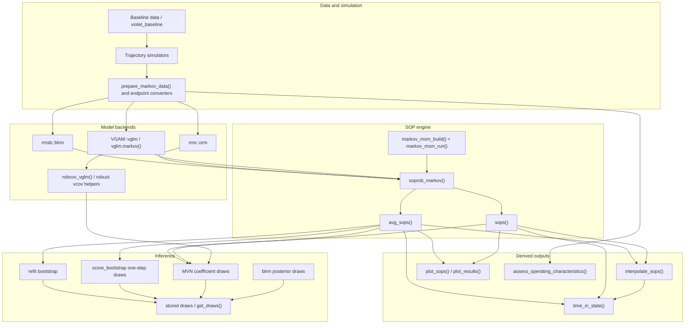

# markov.misc Architecture

## Overview

`markov.misc` is an R package for simulating and analyzing longitudinal
discrete health states, with a strong emphasis on ordinal clinical-trial
outcomes. The core workflow is:

1. Generate or prepare patient trajectories with columns such as `id`, `time`,
   `y`, `yprev`, and `tx`.
2. Fit a transition model with one of the supported ordinal backends.
3. Project state occupancy probabilities (SOPs) forward over visits or days.
4. Standardize over counterfactual treatment assignments with G-computation.
5. Add uncertainty by posterior draws, coefficient simulation, score bootstrap,
   or refit bootstrap.
6. Convert SOPs into derived estimands such as time in state, DRS, TTE-style
   endpoints, and operating-characteristic summaries.

The package is intentionally pragmatic: most statistical work happens in
standard modeling packages (`VGAM`, `rms`, `rmsb`, `survival`, `ordinal`), while
`markov.misc` supplies the Markov recursion, model adaptation, bootstrap
orchestration, simulation data-generating mechanisms, and plotting utilities.

## Architecture Diagram

## Data Contracts

Most package workflows assume long-format patient trajectories:

| Field | Role |
|---|---|
| `id` | Patient or cluster identifier. Used for longitudinal grouping, bootstrap resampling, and cluster-robust covariance. |
| `time` | Visit or time index. It may be numeric or a factor-valued visit index in SOP workflows. |
| `y` | Observed ordered state at `time`. |
| `yprev` | Previous state. Usually a factor after `prepare_markov_data()`, but numeric previous-state effects are supported for linear or spline terms. |
| `tx` | Treatment or counterfactual assignment variable used by G-computation and power workflows. |

`prepare_markov_data()` in `R/misc.R` removes rows whose previous state is
absorbing, optionally coerces `yprev` to a factor, and optionally coerces `y` to
an ordered response. Bootstrap helper paths preserve numeric previous-state
columns when the model uses numeric or nonlinear previous-state effects.

SOP prediction can operate on visit-scale time. For irregular real assessment
days, fit the model on visit indices and use `interpolate_sops()` or
`time_in_state(..., time_map = ...)` to map visit SOPs back to elapsed time.

## Model Backends

### VGAM Ordinal Models

`VGAM::vglm()` fits are supported when they use cumulative ordinal models
compatible with the Markov recursion. `vglm.markov()` in `R/vglm_helpers.R`
wraps `VGAM::vglm()` and adds support for `rms` formula helpers such as inline
`rcs()` terms. `robcov_vglm()` in `R/robcov_vglm.R` computes robust or
cluster-robust covariance matrices and stores the underlying fit, coefficients,
score contributions, bread, meat, and cluster vector for later inference.

### RMS Ordinal Models

`rms::orm()` is a first-class backend for first-order proportional-odds SOP
prediction. The fast path uses `get_effective_coefs()` from `R/vgam_helpers.R`
to place threshold and slope coefficients into a matrix compatible with the
same Markov runner used by `vglm` models. Robust covariance can come from
`rms::robcov()` or from `get_vcov_robust()`.

### Bayesian RMSB Models

`rmsb::blrm()` models are handled in `R/sops.R`. SOP and marginal SOP calls
sample posterior draws directly, cache gamma coefficient draws, optionally
include fitted `cluster()` random effects for known IDs, and summarize posterior
SOP draws. Because posterior uncertainty is already embedded, `inferences()`
returns `blrm`-derived `markov_sops` or `markov_avg_sops` objects unchanged.

### Unsupported Model Features

Markov SOP workflows reject models fit with offsets. Offset detection lives in
`R/helper.R` (`model_uses_offset()` and `stop_unsupported_offset()`) and is
called from model validation in `R/sops.R`.

## SOP Engine

`soprob_markov()` in `R/sops.R` is the central recursion engine. It projects a
probability distribution over states through time by expanding each patient over
all possible previous states, predicting transition probabilities in batches,
and applying the law of total probability. Absorbing states retain accumulated
probability mass.

The first-order recursion updates
`P(S_t = k) = sum_j P(S_{t-1} = j) P(S_t = k | S_{t-1} = j)`.
When `p2varname` is supplied, the engine carries a joint history distribution
and uses a second-order recursion over `(S_{t-2}, S_{t-1})`.

`sops()` wraps `soprob_markov()` for individual-level or stratified SOP output.
It returns a data frame with class `markov_sops` and stores the fitted model,
original prediction data, state levels, time variables, and call arguments as
attributes for downstream inference.

`avg_sops()` performs G-computation. It builds a counterfactual grid from
`variables`, duplicates the baseline or longitudinal input data across the
grid, runs SOP prediction, and marginalizes patient-level SOP arrays into a
population-average `markov_avg_sops` object. For bootstrap inference,
`avg_sops()` must receive the full longitudinal data so the refit bootstrap can
resample whole patients.

## Fast Prediction Path

Frequentist first-order `vglm` and full proportional-odds `orm` models can use a
fast path during simulation-based inference:

1. `markov_msm_build()` precomputes model matrices by time point and previous
   state while respecting factor visit times, time-varying covariates, optional
   `gap`, and fitted factor levels.
2. `get_effective_coefs()` converts model coefficients into a threshold-by-term
   gamma matrix.
3. `markov_msm_run()` performs the Markov loop with matrix multiplication and
   `lp_to_probs()`, avoiding repeated calls to backend `predict()` methods.

This path is why MVN and score-bootstrap inference can run many coefficient
draws without rebuilding design matrices for every draw.

## Inference Workflows

`inferences()` in `R/sops.R` is the user-facing dispatcher for uncertainty on
`markov_sops` and `markov_avg_sops` objects.

| Method | Entry path | Main implementation | Notes |
|---|---|---|---|
| Posterior | `sops()` / `avg_sops()` with `blrm` | `sops_blrm()`, `avg_sops_blrm()` | Draws are native to the model; `inferences()` is a no-op. |
| MVN simulation | `inferences(method = "simulation", engine = "mvn")` | `inferences_simulation()` | Draws coefficients from `coef` and `vcov`, then reruns SOP prediction. |
| Score bootstrap | `inferences(method = "simulation", engine = "score_bootstrap")` | `generate_score_bootstrap_draws()` | Supports `markov_avg_sops`; uses cluster-level multiplier weights and a one-step Newton approximation. |
| Refit bootstrap | `inferences(method = "bootstrap")` | `inferences_bootstrap()` | Supports `markov_avg_sops`; resamples patients, refits the model, and recomputes marginal SOPs. |

Coefficient and covariance helpers are in `R/mvn_helpers.R`. They provide
`set_coef()` methods for `vglm`, `vgam`, `orm`, `lrm`, `rms`, and
`robcov_vglm`, plus `get_vcov_robust()` and validation helpers.

Reusable bootstrap infrastructure is split into `R/bootstrap_helpers.R`:
`fast_group_bootstrap()` samples patient IDs, `materialize_bootstrap_sample()`
joins sampled IDs back to the original data just in time,
`apply_to_bootstrap()` runs sequential or `future.callr` parallel analyses, and
`bootstrap_analysis_wrapper()` centralizes factor releveling, `datadist`
updates, and model refits. `R/bootstrap.R` builds on these helpers for
`bootstrap_model_coefs()` and `bootstrap_standardized_sops()`.

## Simulation Engines

Simulation code lives in `R/simulate_trajectories.R`.

| Function | Data-generating mechanism |
|---|---|
| `sim_trajectories_markov()` | Discrete-time proportional-odds Markov simulator using `lp_function`, defaulting to `lp_violet()`. |
| `sim_trajectories_brownian()` | Latent Gaussian random-walk severity process thresholded into ordered states. |
| `sim_trajectories_brownian_gap()` | Brownian simulator with random assessment refresh days and optional patient-specific drift heterogeneity. |
| `sim_actt2_brownian()` | ACTT2-style Brownian trajectory generator. |
| `sim_trajectories_deterministic()` | Deterministic latent curves with noise for stress tests. |
| `sim_trajectories_tte()` | Latent time-to-event / recurrent-event process with treatment-specific hazard ratios. |
| `recurr_event()` | Recurrent event-time helper used by the TTE simulator. |

`R/lp_violet.R` contains `lp_violet()`, the default linear predictor for the
VIOLET-inspired Markov simulator. `R/data.R` documents `violet_baseline`, a
large reusable baseline dataset generated from `data-raw/violet_baseline.R`.

## Derived Estimands and Visualization

`R/misc.R` contains endpoint conversion and summary helpers:
`states_to_ttest()`, `states_to_drs()`, `states_to_tte()`,
`states_to_tte_old()`, `calc_time_in_state_diff()`, `format_competing_risks()`,
`tidy_bootstrap_coefs()`, and `jackknife_mcse()`.

`interpolate_sops()` and `time_in_state()` in `R/sops.R` convert SOP output into
real-time curves and area-under-the-curve summaries. They preserve or recompute
uncertainty intervals from stored draws when available.

`R/viz.R` provides:

- `plot_sops()` for empirical trajectory SOPs and model-derived
  `markov_sops` / `markov_avg_sops` objects, including uncertainty ribbons and
  draw overlays when stored draws are available.
- `plot_bootstrap_sops()` for legacy bootstrap SOP outputs.
- `plot_results()` for operating-characteristic result summaries.

`R/archive.R` contains older but still exported TAOOH utilities
(`taooh()` and `taooh_bootstrap2()`). New development should generally prefer
the `avg_sops()` plus `time_in_state()` path unless maintaining those legacy
interfaces directly.

## Operating Characteristics

`R/power.R` provides trial-simulation orchestration:

- `sample_from_arrow()` samples patient IDs from Arrow datasets without loading
  all rows or columns into memory.
- `tidy_po()` extracts comparable coefficient summaries from several fitted
  model classes.
- `assess_operating_characteristics()` samples data for each analysis strategy,
  applies user-supplied fitting functions, and writes detailed results.
- `run_power_iteration()` aliases the same iteration runner for older calling
  code.
- `summarize_oc_results()` and `summarize_power_results()` aggregate bias,
  power, Monte Carlo SE, and coverage.

## Code Reference Index

| Component | File | Key symbols |
|---|---|---|
| Common helpers and validation | `R/helper.R` | `%||%`, `bind_rows_fill()`, `left_join_preserve_order()`, `matrix_to_long()`, `model_uses_offset()` |
| Data preparation and endpoints | `R/misc.R` | `prepare_markov_data()`, `relevel_factors_consecutive()`, `states_to_drs()`, `states_to_tte()`, `calc_time_in_state_diff()` |
| Default simulation predictor | `R/lp_violet.R` | `lp_violet()` |
| Packaged baseline data | `R/data.R`, `data/violet_baseline.rda`, `data-raw/violet_baseline.R` | `violet_baseline` |
| Simulation engines | `R/simulate_trajectories.R` | `sim_trajectories_markov()`, `sim_trajectories_brownian()`, `sim_trajectories_brownian_gap()`, `sim_actt2_brownian()`, `sim_trajectories_tte()`, `recurr_event()` |
| VGAM model adapter | `R/vglm_helpers.R` | `vglm.markov()`, `add_rms_formula_helpers()` |
| Effective coefficient matrices | `R/vgam_helpers.R` | `get_effective_coefs()` |
| Robust covariance for VGAM | `R/robcov_vglm.R` | `robcov_vglm()`, `compute_scores_vglm()`, `compare_se_orm_vglm()` |
| Coefficient simulation helpers | `R/mvn_helpers.R` | `set_coef()`, `get_vcov_robust()`, `get_coef()` |
| SOP recursion and summaries | `R/sops.R` | `soprob_markov()`, `sops()`, `avg_sops()`, `standardize_sops()` |
| SOP interpolation and AUC | `R/sops.R` | `interpolate_sops()`, `time_in_state()` |
| Fast Markov runner | `R/sops.R` | `markov_msm_build()`, `markov_msm_run()`, `lp_to_probs()`, `compute_Gamma()` |
| Inference dispatcher | `R/sops.R` | `inferences()`, `inferences_simulation()`, `generate_score_bootstrap_draws()`, `inferences_bootstrap()`, `get_draws()` |
| Bootstrap infrastructure | `R/bootstrap_helpers.R` | `fast_group_bootstrap()`, `materialize_bootstrap_sample()`, `apply_to_bootstrap()`, `bootstrap_analysis_wrapper()` |
| Bootstrap user wrappers | `R/bootstrap.R` | `bootstrap_model_coefs()`, `bootstrap_standardized_sops()` |
| Operating characteristics | `R/power.R` | `sample_from_arrow()`, `tidy_po()`, `assess_operating_characteristics()`, `run_power_iteration()`, `summarize_oc_results()` |
| Visualization | `R/viz.R` | `plot_sops()`, `plot_bootstrap_sops()`, `plot_results()` |
| Legacy TAOOH utilities | `R/archive.R` | `taooh()`, `taooh_bootstrap2()` |

## Maintenance Notes

When changing architecture-relevant behavior, update this file alongside the
code. In particular, keep it current when:

- Adding or removing model backends supported by `soprob_markov()`, `sops()`,
  `avg_sops()`, or `inferences()`.
- Changing the expected data contract for `id`, `time`, `y`, `yprev`, `tx`,
  `p2varname`, `gap`, or `t_covs`.
- Moving fast-path code between `R/sops.R`, `R/vgam_helpers.R`, and
  `R/vglm_helpers.R`.
- Changing inference semantics, especially whether draws are stored and how
  `get_draws()` should interpret them.
- Adding a simulation engine, endpoint converter, or operating-characteristic
  summary that participates in the main simulation-to-analysis workflow.
