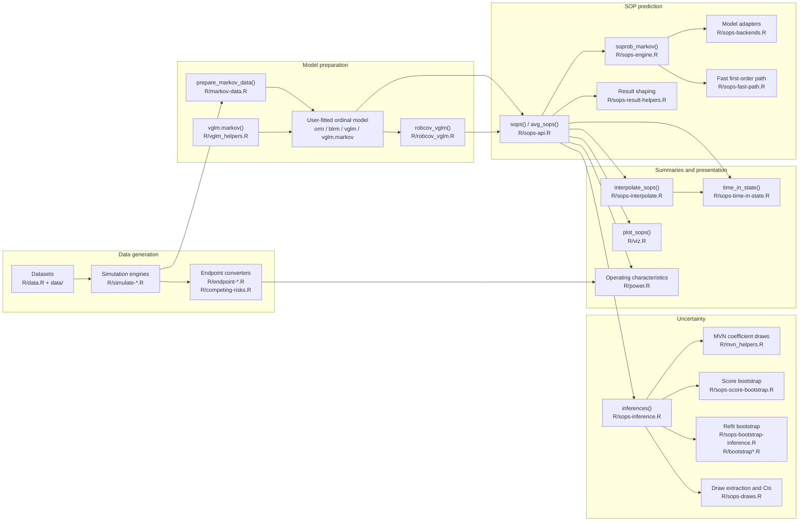
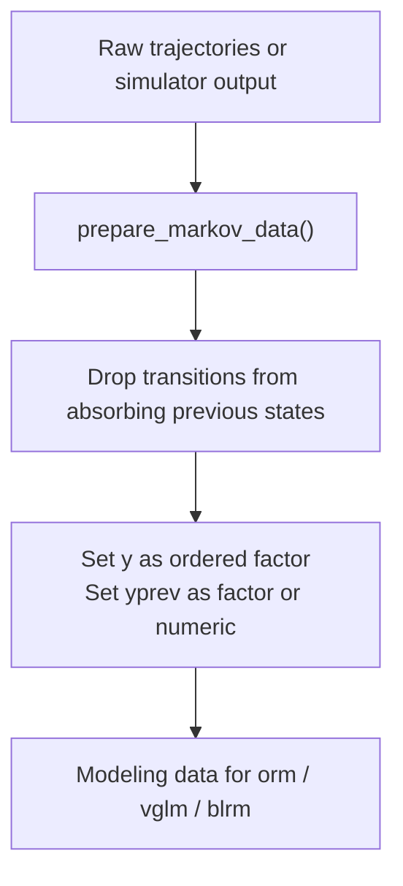
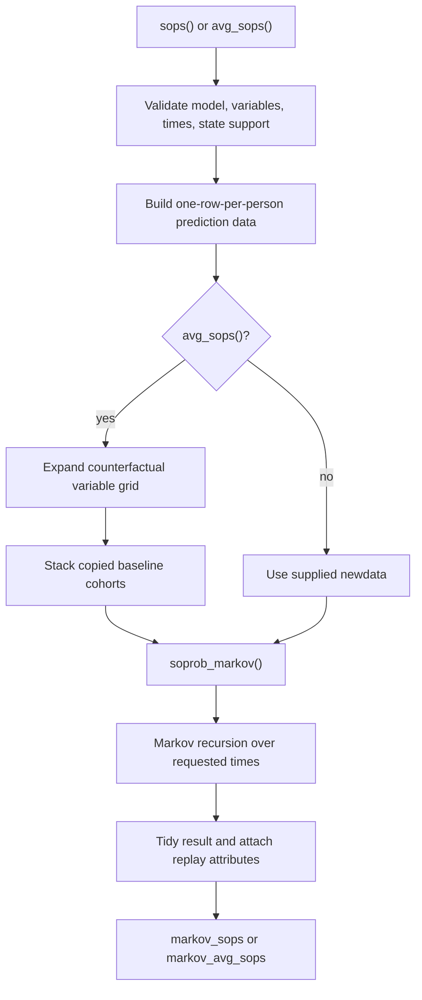
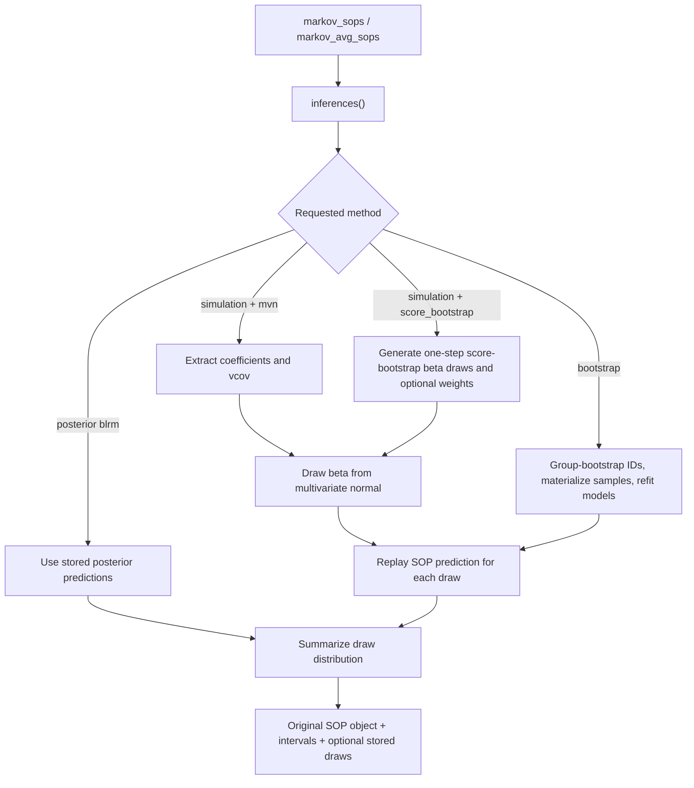
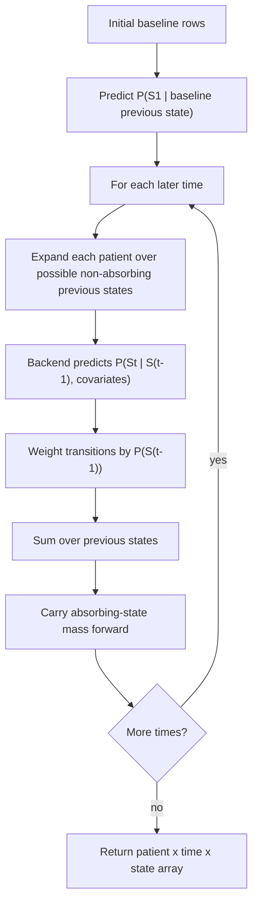
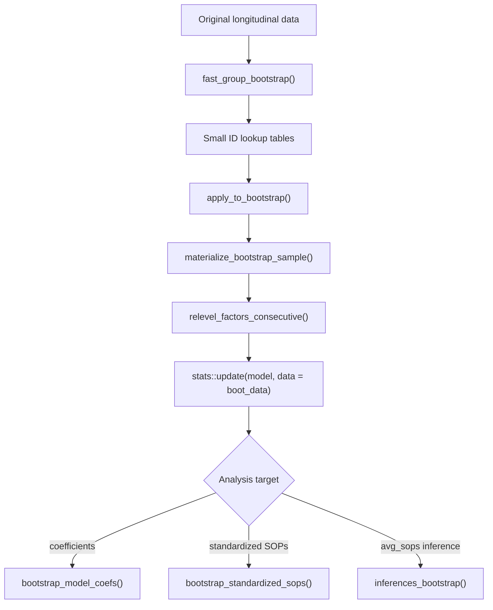

# markov.misc Architecture

`markov.misc` is an R package for simulating ordinal disease trajectories,
fitting discrete-time Markov transition models, converting those models into
state occupancy probabilities (SOPs), and evaluating downstream endpoints such
as time in state, time-to-event summaries, bootstrap intervals, and operating
characteristics.

The package is built around a small set of stable contracts:

- Longitudinal state data use one row per patient and visit, usually with
  `id`, `time`, `y`, `yprev`, and `tx`.
- Fitted transition models predict the distribution of the next state
  conditional on baseline/covariate data plus previous-state history.
- SOP engines return either patient-level probability arrays or tidy
  `markov_sops` / `markov_avg_sops` data frames with enough attributes to run
  inference later.
- Inference engines work by replaying the original SOP request with new
  coefficient draws, posterior draws, score-bootstrap weights, or refit
  bootstrap samples.

This document describes the current design, the main code paths, and how to
extend the package without breaking those contracts.

## Package Map

## Source Layout

The package is organized by workflow stage rather than by model class.

| Area | Files | Main responsibilities |
| --- | --- | --- |
| Shared utilities | `R/helper.R`, `R/globals.R`, `R/misc.R` | Lightweight base-R helpers, Arrow expression helpers, offset detection, NSE global registrations. |
| Data contracts | `R/markov-data.R`, `R/data.R` | Convert raw trajectories to Markov modeling data, preserve factor/numeric previous-state semantics, document built-in datasets. |
| Simulation | `R/simulate_trajectories.R`, `R/simulate-markov.R`, `R/simulate-brownian.R`, `R/simulate-brownian-gap.R`, `R/simulate-deterministic.R`, `R/simulate-recurrent-event.R`, `R/simulate-tte.R`, `R/lp_violet.R` | Generate synthetic longitudinal ordinal trajectories from several data-generating mechanisms. |
| Model fitting helpers | `R/vglm_helpers.R`, `R/vgam_helpers.R`, `R/robcov_vglm.R`, `R/mvn_helpers.R` | Fit package-aware VGAM Markov models, compute effective coefficients, compute robust covariance, mutate coefficients for simulation draws. |
| SOP API | `R/sops.R`, `R/sops-api.R`, `R/sops-standardize.R` | Public user entrypoints for individual SOPs, standardized/marginal SOPs, and legacy standardization. |
| SOP engine | `R/sops-engine.R`, `R/sops-backends.R`, `R/sops-fast-path.R`, `R/sops-result-helpers.R` | Validate models, predict transition probabilities, run first- and second-order Markov recursions, reshape arrays to tidy objects. |
| SOP inference | `R/sops-inference.R`, `R/sops-draws.R`, `R/sops-score-bootstrap.R`, `R/sops-bootstrap-inference.R` | Compute uncertainty intervals from MVN coefficient draws, posterior draws, score bootstrap draws, or refit bootstrap samples. |
| Bootstrap infrastructure | `R/bootstrap_helpers.R`, `R/bootstrap.R`, `R/bootstrap-tidy.R` | Memory-efficient group bootstrap sampling, just-in-time materialization, model refitting, bootstrap coefficient and SOP summaries. |
| Endpoint summaries | `R/endpoint-summaries.R`, `R/endpoint-tte.R`, `R/competing-risks.R`, `R/sops-time-in-state.R`, `R/sops-interpolate.R` | Convert trajectories or SOPs to days-at-home, time-to-event, competing-risk, real-time interpolation, and time-in-state summaries. |
| Operating characteristics | `R/power.R` | Sample from Arrow superpopulations, run iteration-level analyses, summarize power, type I error, bias, coverage, and Monte Carlo error. |
| Visualization | `R/viz.R` | Plot empirical or model-derived SOPs, bootstrap SOP bands, and operating-characteristic summaries. |

## Core Data Contracts

### Longitudinal Trajectory Data

Most package functions expect a data frame with these columns:

| Column | Meaning |
| --- | --- |
| `id` | Patient or cluster identifier. Bootstrap and marginalization assume one baseline row per unique `id`. |
| `time` | Visit index or elapsed time. SOP prediction can use numeric time or factor-valued visit levels. |
| `y` | Current observed ordinal state at `time`. |
| `yprev` | Previous state used by the transition model. The first observed row may have `NA`, but modeling data usually excludes rows after absorbing states. |
| `tx` | Treatment or scenario variable. Public APIs allow alternative names through argument lists. |

`prepare_markov_data()` in `R/markov-data.R` applies the modeling version of this
contract. It removes rows whose previous state is absorbing, converts `y` to an
ordered factor when requested, and leaves `yprev` either categorical or numeric
depending on `factor_previous`. Numeric previous states are important for models
such as `rms::rcs(yprev, 6)`.

### State Levels and Absorbing States

The package treats state labels as ordered, stable values. Public SOP calls pass
state support through `ylevels` and absorbing states through `absorb`. Internally:

- `as_state_labels()` normalizes levels to character labels for comparisons.
- Absorbing-state mass is carried forward during SOP recursion.
- Bootstrap samples can miss states; `relevel_factors_consecutive()` maps the
  sample to consecutive states for fitting and later maps predictions back to
  the original state space.

### SOP Arrays

`soprob_markov()` is the low-level array producer.

| Model family | Array shape | Meaning |
| --- | --- | --- |
| Frequentist models | `[patient, time, state]` | Individual predicted probability for each patient, visit, and state. |
| `rmsb::blrm` models | `[draw, patient, time, state]` | Posterior draw-specific probability for each patient, visit, and state. |

Dimnames are used where possible for patient IDs, requested times, and state
labels. Higher-level functions convert these arrays into tidy outputs.

### Tidy SOP Objects

`sops()` returns individual-level or grouped SOPs with class `markov_sops`.
`avg_sops()` returns marginal G-computation summaries with class
`markov_avg_sops`.

Core columns are:

| Object | Core columns |
| --- | --- |
| `markov_sops` | Baseline covariates, optional `rowid`, `time`, `state`, `estimate`. If `by` is supplied, rows are averaged over `time`, `state`, and `by`. |
| `markov_avg_sops` | `time`, `state`, `estimate`, counterfactual variables such as `tx`, and optional `by` variables. |
| Objects after `inferences()` | Original columns plus `conf.low`, `conf.high`, `std.error`, and inference metadata attributes. |

Important attributes are set in `set_sops_attrs()`:

| Attribute | Purpose |
| --- | --- |
| `model` | The fitted model needed to replay prediction during inference. |
| `call_args` | Requested times, states, absorbing states, time/previous-state variable names, gaps, time covariates, and grouping variables. |
| `tvarname`, `pvarname`, `p2varname`, `gap` | Names of dynamic transition-history variables. |
| `ylevels`, `absorb` | State support and absorbing states. |
| `t_covs` | Time-dependent covariate lookup used when formulas contain spline bases or other derived time columns. |
| `by` | Stratification variables for grouped individual SOPs. |
| `newdata_orig` | Original prediction data, used by inference and interpolation anchors. |
| `avg_args` | Extra marginalization instructions for `markov_avg_sops`: variables, grid, ID variable, and grouping. |
| `draws`, `simulation_draws`, `bootstrap_draws` | Optional stored draw-level outputs. |

These attributes are part of the architecture. Downstream functions such as
`inferences()`, `get_draws()`, `interpolate_sops()`, `time_in_state()`, and
`plot_sops()` rely on them.

## Primary User Workflows

### 1. Simulate or Prepare Trajectories

The package can either consume user-supplied longitudinal data or generate
synthetic trajectories.

Simulation entrypoints share the same broad output contract but differ in the
data-generating mechanism:

- `sim_trajectories_markov()` uses a proportional-odds transition model with a
  user-supplied linear predictor such as `lp_violet()`.
- `sim_trajectories_brownian()` uses a latent continuous severity random walk
  thresholded into ordinal states.
- `sim_trajectories_brownian_gap()` separates daily latent severity evolution
  from observed state refreshes, which reduces unrealistic day-to-day switching.
- `sim_actt2_brownian()` wraps the Brownian-gap simulator with ACTT-2-inspired
  defaults.
- `sim_trajectories_deterministic()` implements a line-of-destiny latent
  trajectory with absorbing recovery and death states.
- `sim_trajectories_tte()` uses recurrent event times and last-observation
  carry-forward expansion to daily ordinal trajectories.

Endpoint converters in `R/endpoint-summaries.R`, `R/endpoint-tte.R`, and
`R/competing-risks.R` then reshape trajectories into t-test, days returned to
baseline, start-stop, competing-risk, and true time-in-state summaries.

### 2. Fit a Transition Model

`markov.misc` does not own most fitting routines. The user fits an ordinal model
with `rms`, `rmsb`, or `VGAM`, then passes it into SOP functions.

Supported model families:

| Family | Typical fit | Notes |
| --- | --- | --- |
| `rms::orm` | `orm(y ~ tx + time + yprev, x = TRUE, y = TRUE)` | Full proportional odds. Can be wrapped by `rms::robcov()`. |
| `rmsb::blrm` | Bayesian ordinal regression | Posterior draws drive SOP uncertainty directly. Supports selected random-effect handling through `cluster()`. |
| `VGAM::vglm` | `vglm(..., family = cumulative(reverse = TRUE, ...))` | Must be a cumulative model with `reverse = TRUE`. Offsets are unsupported. |
| `vglm.markov()` | Package wrapper around `VGAM::vglm()` | Recommended VGAM path for inline `rms::rcs()` terms and partial proportional odds constraints. |
| `robcov_vglm` | `robcov_vglm(vglm_fit, cluster = id)` | Stores a robust sandwich covariance while preserving the underlying `vglm` fit for prediction. |

The model validation boundary is `validate_markov_model()` in
`R/sops-backends.R`. It rejects unsupported offsets and guards the VGAM
cumulative-family assumptions before recursive SOP prediction starts.

### 3. Predict State Occupancy Probabilities

There are two public SOP styles:

- `sops()` estimates individual or stratified state occupancy probabilities.
- `avg_sops()` estimates marginal state occupancy probabilities under
  counterfactual variable settings, usually treatment arms.

`avg_sops()` is a G-computation wrapper. It creates a counterfactual grid from
`variables`, duplicates baseline data for each grid row, calls the same SOP
engine, and averages over the patient dimension. Optional `by` variables keep
subgroup averages separate.

### 4. Add Inference

`inferences()` takes an existing SOP object and adds uncertainty intervals.
It relies on the SOP object's attributes to replay the original prediction
request under new model coefficients or resampled data.

The inference methods are intentionally separate:

- Bayesian `blrm` outputs already represent posterior prediction draws. The
  package summarizes those draws rather than simulating new coefficients.
- MVN simulation draws coefficients from `coef(model)` and a covariance matrix
  from `stats::vcov()`, `rms::robcov()`, or `robcov_vglm()`.
- Score bootstrap uses row-level model scores and cluster multipliers to make
  one-step coefficient draws without full refits.
- Refit bootstrap resamples patients by ID, materializes each bootstrap sample,
  refits the model, and recomputes `avg_sops()`.

For first-order frequentist `orm` and `vglm` models, simulation inference can use
the optimized fast path. Second-order Markov models fall back to replaying the
full engine with `set_coef()`.

## SOP Engine Internals

### First-Order Recursion

`soprob_markov()` is the central computational function in `R/sops-engine.R`.
It predicts the marginal distribution over future states using the fitted
transition model and the law of total probability.

Backend-specific prediction functions live in `R/sops-backends.R`:

- `predict_vglm_response_markov()` handles ordinary `vglm` prediction and the
  package-native `vglm.markov()` matrix path.
- `predict_orm_response_markov()` builds an `orm` design matrix and converts
  threshold linear predictors to category probabilities.
- `predict_blrm_response_markov()` evaluates posterior draws, optional
  proportional-odds deviations, and optional random effects.

`lp_to_probs()` in `R/sops-fast-path.R` centralizes the conversion from
cumulative logits to state probabilities.

### Second-Order Recursion

When `p2varname` is supplied, `soprob_markov()` dispatches to
`soprob_markov_second_order_run()`. The state distribution is no longer enough;
the recursion tracks joint history over `(S(t-2), S(t-1))`. That enables models
whose transition probability depends on two lagged states, at the cost of a
larger expanded state space and no fast-path inference.

### Time and Gap Handling

Time handling is centralized in backend helpers:

- Numeric time can be generated from the requested `times` sequence.
- Factor time can use fitted factor levels when `times = NULL`.
- `t_covs` supplies precomputed time-dependent covariates such as spline bases.
- `gap` allows transition models to include the elapsed interval since the
  previous observation.
- Factor-valued visit models with gaps require a numeric gap value supplied
  through `t_covs`.

This design keeps modeling formulas flexible while making prediction explicit:
the SOP engine only uses time values and time covariates it can reconstruct.

## Model Adapter Design

The adapter layer lets one recursion engine work with several model classes.
Each adapter must answer one question: for a prediction data frame, what is the
probability of each next state?

### `orm`

`rms::orm` support assumes a full proportional-odds model. The adapter:

1. Builds an `rms`-compatible model matrix with `orm_model_matrix()`.
2. Uses `get_effective_coefs_orm()` to assemble threshold-specific linear
   predictor coefficients.
3. Converts cumulative logits to category probabilities.

For inference, `set_coef.orm()` mutates a copy of the model coefficients, and
`get_vcov_robust()` can use `rms::robcov()` output.

### `vglm` and `vglm.markov`

VGAM support has two paths:

- Ordinary `VGAM::predict(..., type = "response")` for compatible models.
- A package-native model-matrix path for `vglm.markov()` fits and inline spline
  metadata.

`vglm.markov()` in `R/vglm_helpers.R` mirrors `VGAM::vglm()` but adds two package
behaviors:

- It injects `rms` formula helpers such as `rcs()` and `%ia%` while constructing
  model frames and prediction matrices.
- It splits inline restricted cubic spline assignment metadata by generated
  basis column so partial proportional-odds constraints can target those columns.

`get_effective_coefs_vglm()` combines VGAM constraint matrices with raw
coefficients so the fast path can compute threshold linear predictors with
matrix multiplication.

### `robcov_vglm`

`robcov_vglm()` computes a sandwich covariance object for VGAM fits while
keeping the original `vglm` object inside `vglm_fit`. This wrapper participates
in three places:

- `validate_markov_model()` unwraps the fit for model-family checks.
- Prediction uses `vglm_fit`.
- Inference uses the robust covariance in `var`.

The score calculation uses VGAM's VLM model matrix and derivative information to
obtain observation-level score contributions, then optionally aggregates them
by cluster.

### `blrm`

Bayesian `rmsb::blrm` support treats posterior draws as the uncertainty source.
The backend:

- Selects a deterministic subset of posterior draws when `n_draws` is supplied.
- Builds prediction design matrices with `rms::predictrms`.
- Handles full and partial proportional-odds effects.
- Optionally includes random-effect draws for clustered models when requested.

The result shape is draw-aware from the start: posterior SOP arrays carry a draw
dimension, and public APIs summarize or preserve those draws depending on
`return_draws`.

## Fast Path

`R/sops-fast-path.R` exists to avoid expensive per-draw model object mutation
for common first-order models. It precomputes the pieces needed for repeated
prediction:

1. `markov_msm_build()` resolves design information, effective coefficients,
   transition state support, and prediction scaffolds.
2. `compute_Gamma()` turns a coefficient vector into threshold-specific
   effective coefficients.
3. `markov_msm_run()` runs the Markov recursion for a coefficient vector without
   calling high-level `predict()` repeatedly.

The fast path is used when inference can be expressed as many draws of the same
first-order `orm` or `vglm` model. It is deliberately bypassed for second-order
models and model configurations whose prediction data cannot be reconstructed by
the fast-path scaffolding.

## Bootstrap Design

Bootstrap code is split between general-purpose helpers and SOP-specific
orchestration.

The key design choice is just-in-time materialization. `fast_group_bootstrap()`
stores only sampled IDs and unique bootstrap IDs. Workers receive a lookup
table, join it to the original data, refit, and return only the requested
result. This avoids storing all bootstrap data sets at once and keeps repeated
patient samples identifiable through `new_id`.

`bootstrap_analysis_wrapper()` centralizes the fragile parts of refitting:

- Relevel missing factor states to consecutive integers.
- Update `rms::datadist()` for `orm` fits when needed.
- Optionally use original VGAM coefficients as starting values.
- Return the fitted model, releveled data, updated state support, and missing
  states.

SOP bootstrap inference currently targets `markov_avg_sops`, because marginal
SOPs have a clear population-level resampling interpretation.

## Score Bootstrap Design

The score-bootstrap engine in `R/sops-score-bootstrap.R` provides a middle path
between MVN simulation and full refitting.

For each draw it:

1. Computes or extracts observation-level score contributions.
2. Aggregates scores by cluster when a cluster variable is provided.
3. Samples exponential multipliers.
4. Applies a one-step update to the coefficient vector using the model
   covariance/bread information.
5. Replays SOP prediction with the updated coefficients.
6. For marginal SOPs, passes normalized baseline weights into marginalization.

This engine is especially useful when refit bootstrap is expensive but cluster
resampling is needed.

## Endpoint and Summary Layer

The package keeps endpoint transformations separate from the SOP engine.

| Function | Input | Output / use |
| --- | --- | --- |
| `states_to_ttest()` | Longitudinal states | One row per patient with count of target-state days. |
| `states_to_drs()` | Longitudinal states | Days returned to baseline, with death assigned a sentinel score. |
| `states_to_tte()` | Longitudinal states | Collapsed start-stop intervals for survival models. |
| `format_competing_risks()` | `states_to_tte()` output | At-risk intervals or event rows with competing-risk status. |
| `calc_time_in_state_diff()` | Simulated trajectories | True treatment contrasts in state-occupation time. |
| `time_in_state()` | SOP arrays, tidy SOPs, or bootstrap SOP frames | Expected total time in target states, optionally on a real-time grid. |
| `interpolate_sops()` | `markov_sops` / `markov_avg_sops` | Visit-scale SOPs mapped and linearly interpolated onto elapsed time. |

`interpolate_sops()` and `time_in_state()` are closely related. Interpolation
maps visit labels to real time, optionally adds an empirical baseline anchor
from `newdata_orig`, interpolates draw-level outputs when available, and
recomputes intervals from interpolated draws. `time_in_state()` then integrates
probabilities by summing visit-scale probabilities or using trapezoidal AUC on
real-time grids.

## Operating Characteristics

`R/power.R` implements iteration-level operating-characteristic simulation.
The design separates data sampling from analysis-specific inference:

1. `sample_from_arrow()` samples patient IDs from large Arrow datasets by
   treatment arm without collecting the entire data set.
2. `assess_operating_characteristics()` samples once per iteration and analysis
   data source, optionally rerandomizes treatment, and calls user-supplied
   fitting functions.
3. Fitting functions own their model-specific inference strategy and must return
   a list whose first element is a one-row summary data frame.
4. Additional analysis artifacts are saved under `output_path/details`.
5. `summarize_oc_results()` aggregates estimates, power/type I error, coverage,
   bias, empirical standard deviations, and jackknife Monte Carlo standard
   errors.

This keeps parallelization naturally at the iteration level and avoids nested
parallel bootstrap work unless the user explicitly puts it inside a fitting
function.

## Visualization

`plot_sops()` in `R/viz.R` handles two data families:

- Empirical trajectory data, where probabilities are computed from observed
  state counts.
- Model-derived SOP summaries, where probabilities come from an `estimate`
  column and optional uncertainty columns or stored draws.

For line plots, model-derived summaries can show confidence ribbons. For stacked
bar plots, `markov_avg_sops` objects with stored draws can overlay a deterministic
subset of draw-level bars. The plotting functions validate that each plotted
time/state/facet/linetype combination is unique, which prevents accidental
overplotting of multiple scenarios.

`plot_bootstrap_sops()` supports the older wide bootstrap SOP format from
`bootstrap_standardized_sops()`. `plot_results()` visualizes operating
characteristic summaries and can combine panels with `patchwork`.

## Validation Boundaries

The package favors explicit early failures where prediction would otherwise be
ambiguous.

Important validation checks include:

- SOP workflows reject model offsets through `model_uses_offset()` and
  `stop_unsupported_offset()`.
- VGAM transition models must be cumulative models with `reverse = TRUE`.
- `by`, counterfactual variables, previous-state variables, ID variables, and
  requested target states are checked against available columns.
- `t_covs` is required when formula-derived time covariates cannot be rebuilt
  from raw `times`.
- `validate_coef_vcov()` requires coefficient vectors and covariance matrices to
  have matching dimensions and names.
- Bootstrap helpers preserve missing-state information so predictions can be
  expanded back to the original state support.

When adding new functionality, prefer adding validation at the boundary where
the user still sees the original argument names rather than deeper inside array
or matrix code.

## Extension Guide

### Add a New Model Backend

To add a supported model class:

1. Extend `validate_markov_model()` in `R/sops-backends.R`.
2. Add a backend prediction function that accepts the standard prediction data
   frame and returns rows by state probabilities.
3. Wire the class into `soprob_markov()`.
4. If coefficient simulation is needed, add `set_coef.<class>()` in
   `R/mvn_helpers.R` and covariance extraction in `get_vcov_robust()`.
5. Decide whether the model can use the fast path. If yes, add effective
   coefficient and design-matrix support in `R/vgam_helpers.R` or a new helper.
6. Add tests for first time point, later-time recursion, absorbing states,
   factor/numeric time, and inference replay.

### Add a New Simulator

New simulators should return the common longitudinal contract:

- `id`, `tx`, `time`, `y`, `yprev`.
- Any latent variables or generated parameters as additional columns.
- Rows ordered by `id` and `time`.
- No time-zero row unless the function explicitly documents it; most current
  simulators drop baseline after using it to compute `yprev`.

If the simulator has absorbing states, carry them forward and document how
baseline absorbing states are handled.

### Add a New Inference Engine

New inference engines should preserve the existing object lifecycle:

1. Accept a `markov_sops` or `markov_avg_sops` object.
2. Use attributes rather than asking the user to repeat the original SOP call.
3. Produce a draw-level data frame with `draw_id`, `time`, `state`, and
   `estimate` whenever possible.
4. Summarize with `compute_ci_from_draws()`.
5. Attach draw attributes only when requested or when storing draws is inherent
   to the model family.
6. Restore original SOP attributes and class with `restore_sops_attrs()`.

### Add a New Endpoint

Endpoint functions should avoid changing SOP internals. Prefer accepting tidy
SOP objects, SOP arrays, or trajectory data explicitly, and document the input
contract. If an endpoint needs uncertainty, operate on stored draws through
`get_draws()` rather than reimplementing inference.

### Add New Plotting Features

Plotting helpers should stay downstream of tidy data contracts. They should not
refit models or rerun SOP prediction. Validate grouping keys before plotting so
duplicated scenarios are caught with actionable messages.

## Testing and Documentation Expectations

Tests live in `tests/testthat/` and should track the package boundaries above.
Useful regression themes include:

- Simulation output contracts and absorbing-state behavior.
- `prepare_markov_data()` with categorical and numeric previous states.
- `vglm.markov()` inline spline terms, `%ia%` formulas, offset rejection, and
  constraints.
- SOP recursion for first-order and second-order models.
- Equivalence between slow prediction and fast-path prediction for eligible
  models.
- `avg_sops()` counterfactual grids, `by` strata, and stored attributes.
- MVN, score-bootstrap, posterior, and refit-bootstrap inference paths.
- Draw extraction, interpolation, and time-in-state integration.
- Missing-state bootstrap samples and mapping back to original state labels.

Generated roxygen documentation in `man/` should be regenerated when exported
interfaces or examples change.

## Code Reference Index

| File | Key symbols | Notes |
| --- | --- | --- |
| `R/helper.R` | `%||%`, `bind_rows_fill()`, `left_join_preserve_order()`, `matrix_to_long()`, `named_list_to_wide()`, `pivot_state_columns_long()`, Arrow helpers, offset helpers | Shared low-level helpers. Keep generic but scoped; these are not intended as full tidyverse replacements. |
| `R/markov-data.R` | `prepare_markov_data()`, `relevel_factors_consecutive()` | Converts trajectories to modeling data and handles missing bootstrap states. |
| `R/simulate-markov.R` | `sim_trajectories_markov()` | Proportional-odds transition simulator. |
| `R/simulate-brownian.R` | `sim_trajectories_brownian()` | Latent Brownian severity simulator. |
| `R/simulate-brownian-gap.R` | `sim_trajectories_brownian_gap()`, `sim_actt2_brownian()` | Brownian simulator with refresh gaps and ACTT-2 defaults. |
| `R/simulate-deterministic.R` | `sim_trajectories_deterministic()` | Line-of-destiny deterministic simulator. |
| `R/simulate-recurrent-event.R` | `recurr_event()` | Recurrent event generator used by TTE simulation. |
| `R/simulate-tte.R` | `sim_trajectories_tte()` | Latent time-to-event simulator expanded to daily states. |
| `R/lp_violet.R` | `lp_violet()` | Default VIOLET-inspired linear predictor for Markov simulation. |
| `R/vglm_helpers.R` | `vglm.markov()`, `add_rms_formula_helpers()`, `split_rcs_assign()` | Package-aware VGAM fitting wrapper. |
| `R/vgam_helpers.R` | `get_effective_coefs()` and class-specific helpers | Converts raw model coefficients and constraints to threshold-specific coefficient matrices. |
| `R/robcov_vglm.R` | `robcov_vglm()`, `compute_scores_vglm()`, `compare_se_orm_vglm()` | Robust covariance and VGAM score support. |
| `R/mvn_helpers.R` | `set_coef()`, `get_vcov_robust()`, `validate_coef_vcov()`, `get_coef()` | Coefficient mutation and covariance extraction for inference. |
| `R/sops-api.R` | `sops()`, `sops_blrm()`, `avg_sops()`, `avg_sops_blrm()` | Main public SOP API. |
| `R/sops-standardize.R` | `standardize_sops()` | Legacy standardized SOP wrapper. |
| `R/sops-engine.R` | `soprob_markov()`, `soprob_markov_second_order_run()` | Core first- and second-order recursive SOP engine. |
| `R/sops-backends.R` | `validate_markov_model()`, `predict_*_response_markov()`, BLRM helpers, ORM matrix helpers, time/gap helpers | Model adapters and dynamic prediction-data construction. |
| `R/sops-fast-path.R` | `markov_msm_build()`, `markov_msm_run()`, `lp_to_probs()`, `compute_Gamma()` | Optimized repeated prediction for eligible first-order models. |
| `R/sops-result-helpers.R` | `set_sops_attrs()`, `restore_sops_attrs()`, `create_counterfactual_data()`, `marginalize_sops_array()`, `array_to_df_individual()` | Tidy SOP object construction and attribute preservation. |
| `R/sops-inference.R` | `inferences()`, `inferences_simulation()` | Main inference dispatcher and coefficient-draw replay. |
| `R/sops-bootstrap-inference.R` | `inferences_bootstrap()` | Refit-bootstrap inference for marginal SOPs. |
| `R/sops-score-bootstrap.R` | `generate_score_bootstrap_draws()`, `score_bootstrap_components()`, `compute_scores_orm()` | One-step score-bootstrap engine. |
| `R/sops-draws.R` | `compute_ci_from_draws()`, `get_draws()` | Interval summaries and draw extraction. |
| `R/bootstrap_helpers.R` | `fast_group_bootstrap()`, `materialize_bootstrap_sample()`, `apply_to_bootstrap()`, `bootstrap_analysis_wrapper()` | Memory-efficient group bootstrap utilities. |
| `R/bootstrap.R` | `bootstrap_model_coefs()`, `bootstrap_standardized_sops()` | Exported bootstrap summaries. |
| `R/bootstrap-tidy.R` | `tidy_bootstrap_coefs()` | Quantile summaries for bootstrap coefficients. |
| `R/sops-interpolate.R` | `interpolate_sops()` and helpers | Visit-to-real-time SOP interpolation and draw-aware interval recomputation. |
| `R/sops-time-in-state.R` | `time_in_state()` and helpers | Expected time in target states for arrays, tidy SOPs, and bootstrap frames. |
| `R/endpoint-summaries.R` | `jackknife_mcse()`, `states_to_ttest()`, `states_to_drs()` | Patient-level endpoint summaries. |
| `R/endpoint-tte.R` | `states_to_tte_old()`, `states_to_tte()`, `calc_time_in_state_diff()` | Start-stop and true time-in-state transformations. |
| `R/competing-risks.R` | `format_competing_risks()` | Competing-risk formatting from start-stop data. |
| `R/power.R` | `sample_from_arrow()`, `tidy_po()`, `assess_operating_characteristics()`, `summarize_oc_results()` | Operating-characteristic simulation helpers. |
| `R/viz.R` | `plot_sops()`, `plot_results()`, `plot_bootstrap_sops()` | SOP, bootstrap, and operating-characteristic plots. |
| `R/globals.R` | `utils::globalVariables()` | CRAN/R CMD check global variable declarations. |

## Glossary

| Term | Meaning |
| --- | --- |
| SOP | State occupancy probability, the probability of being in a given state at a given time. |
| Individual SOP | SOPs for each row/patient in supplied prediction data. |
| Average SOP | Marginal SOPs averaged across a baseline cohort under counterfactual settings. |
| G-computation | Estimating marginal potential outcomes by predicting every patient under each scenario and averaging. |
| First-order Markov model | A transition model depending on the immediately previous state. |
| Second-order Markov model | A transition model depending on the two previous states. |
| Absorbing state | A state that, once reached, is carried forward with probability one. |
| Fast path | Matrix-based SOP replay path for repeated coefficient draws in eligible first-order models. |
| Score bootstrap | Approximate bootstrap using score contributions and multiplier weights instead of full refits. |
| Refit bootstrap | Bootstrap that resamples IDs, refits the model, and recomputes SOPs. |
| Real-time interpolation | Mapping visit-index SOPs to elapsed time and interpolating probabilities for AUC/time-in-state summaries. |
