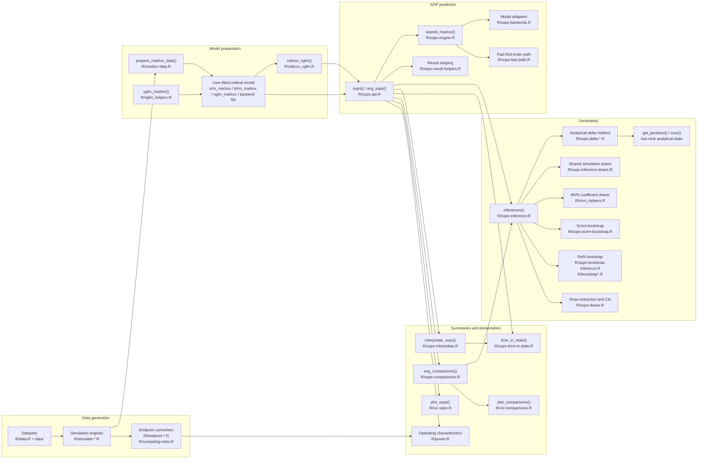
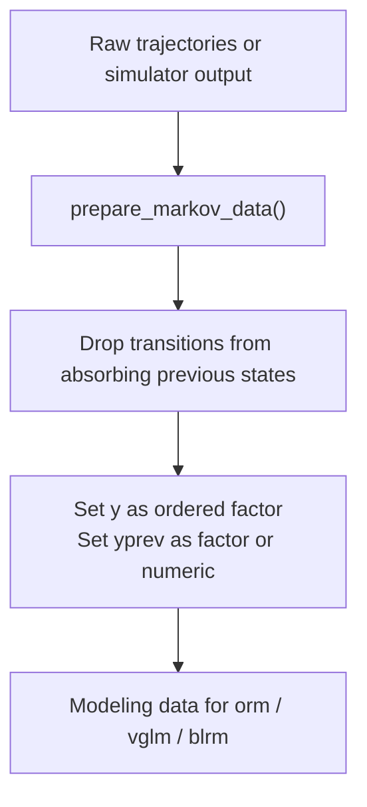
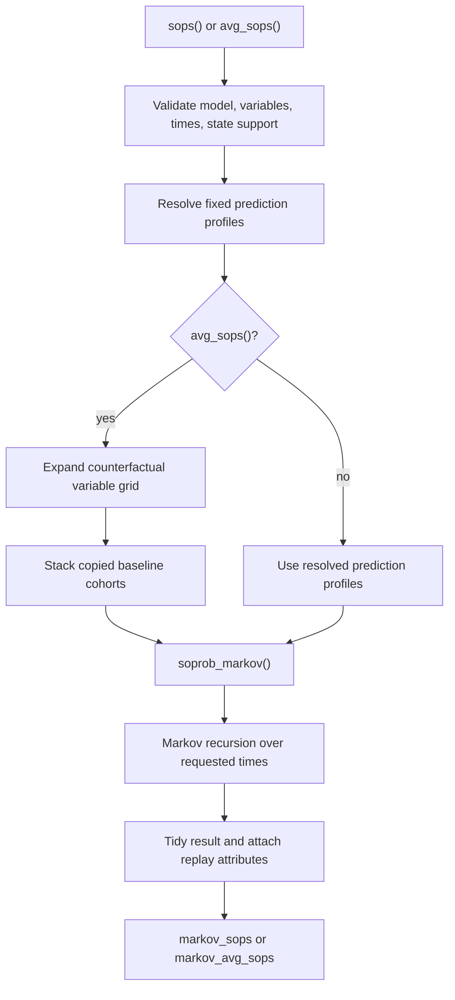
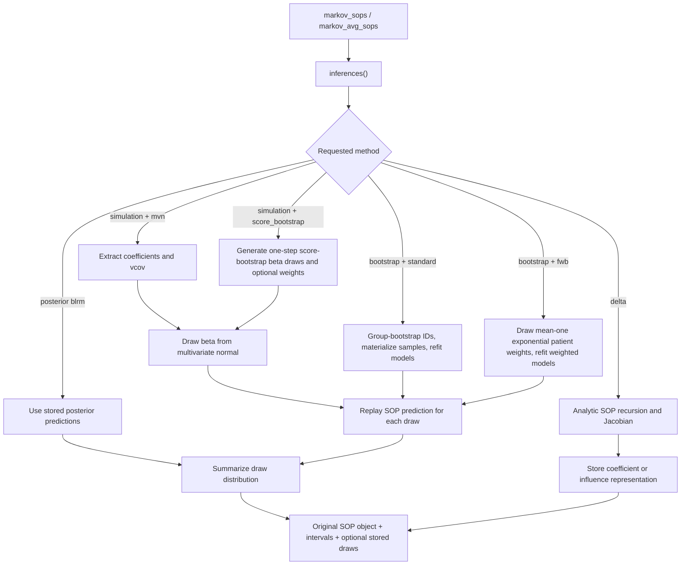
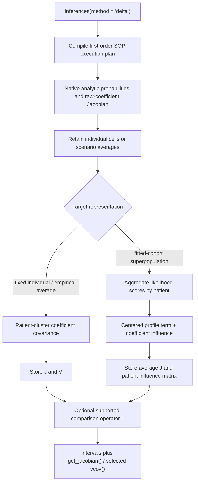
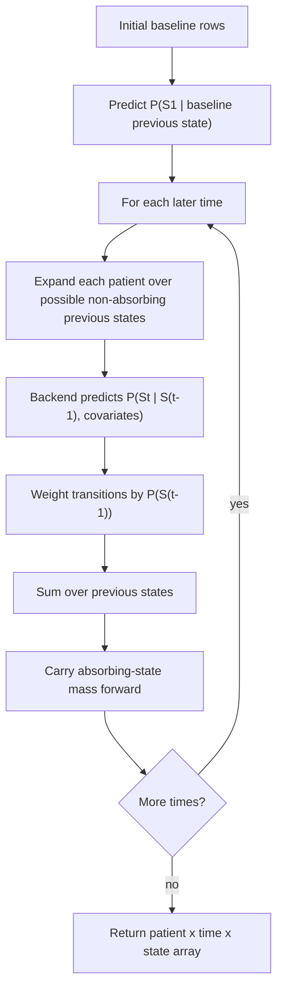
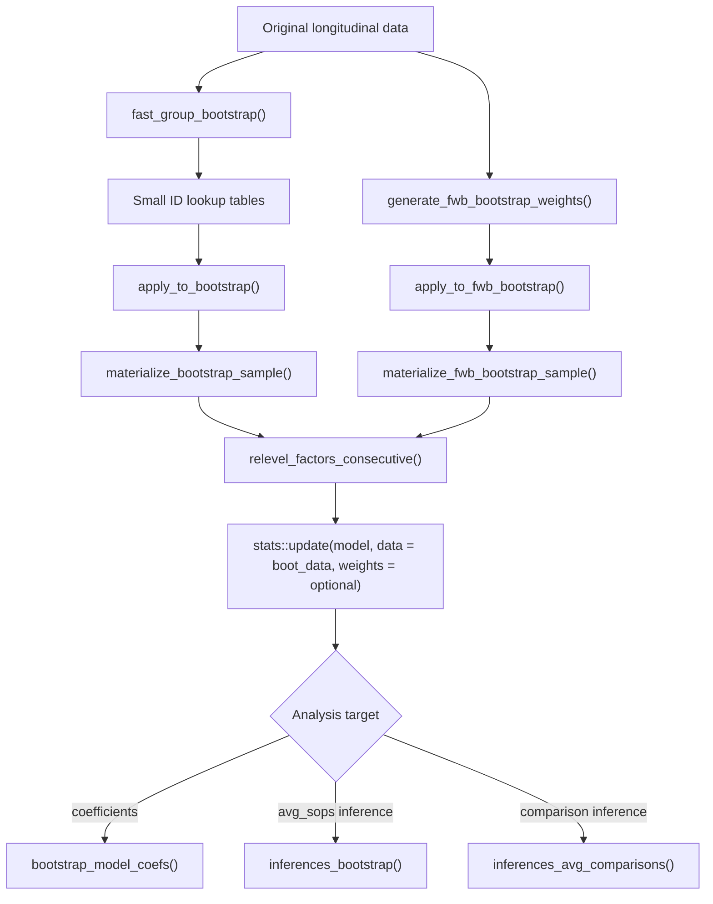

# markov.misc Architecture

`markov.misc` is an R package for simulating ordinal disease trajectories,
fitting discrete-time Markov transition models, converting those models into
state occupancy probabilities (SOPs), and evaluating downstream endpoints such
as time in state, time-to-event summaries, bootstrap intervals, and operating
characteristics.

The package is built around a small set of stable contracts:

- Longitudinal state data use one row per patient and visit, usually with
  `id`, `time`, `y`, `yprev`, and `tx`.
- Fitted transition models predict the distribution of the next state
  conditional on baseline/covariate data plus previous-state history.
- SOP engines return either patient-level probability arrays or tidy
  `markov_sops` / `markov_avg_sops` data frames with enough attributes to run
  inference later.
- Inference engines either replay the original SOP request with coefficient,
  posterior, score-bootstrap, or refit-bootstrap draws, or propagate an
  analytical Jacobian through a coefficient covariance or patient influence
  function.

This document describes the current design, the main code paths, and how to
extend the package without breaking those contracts.

## Package Map

## Source Layout

The package is organized by workflow stage rather than by model class.

| Area | Files | Main responsibilities |
| --- | --- | --- |
| Shared utilities | `R/utils.R`, `R/globals.R` | Lightweight base-R helpers, Arrow expression helpers, offset detection, NSE global registrations. |
| Data contracts | `R/markov-data.R`, `R/data.R` | Convert raw trajectories to Markov modeling data, preserve factor/numeric previous-state semantics, document built-in datasets. |
| Simulation | `R/simulate-markov.R`, `R/simulate-brownian.R`, `R/simulate-brownian-gap.R`, `R/simulate-deterministic.R`, `R/simulate-recurrent-event.R`, `R/simulate-tte.R`, `R/lp_violet.R` | Generate synthetic longitudinal ordinal trajectories from several data-generating mechanisms. |
| Model fitting helpers | `R/vglm_helpers.R`, `R/vgam_helpers.R`, `R/robcov_vglm.R`, `R/mvn_helpers.R` | Fit package-aware VGAM Markov models, compute effective coefficients, compute robust covariance, mutate coefficients for simulation draws. |
| SOP API | `R/sops-api.R` | Public user entrypoints for individual and marginal SOPs. |
| SOP engine | `R/sops-engine.R`, `R/sops-backends.R`, `R/sops-fast-path.R`, `R/sops-result-helpers.R` | Validate models, predict transition probabilities, run first- and second-order Markov recursions, reshape arrays to tidy objects. |
| SOP inference | `R/sops-inference.R`, `R/sops-delta-core.R`, `R/sops-delta-superpopulation.R`, `R/sops-delta-inference.R`, `R/sops-delta-accessors.R`, `R/sops-delta-comparisons.R`, `R/sops-inference-draws.R`, `R/sops-draws.R`, `R/sops-score-bootstrap.R`, `R/sops-bootstrap-inference.R`, `R/sops-comparisons-inference.R` | Compute deterministic first-order delta intervals or uncertainty intervals from MVN coefficient draws, posterior draws, score bootstrap draws, ordinary refit bootstrap samples, or fractional weighted refits. |
| Bootstrap infrastructure | `R/bootstrap_helpers.R`, `R/bootstrap-coefs.R`, `R/bootstrap-tidy.R` | Memory-efficient group bootstrap sampling, fractional weighted bootstrap weights, just-in-time materialization, model refitting, and bootstrap coefficient summaries. |
| Endpoint summaries | `R/endpoint-summaries.R`, `R/endpoint-tte.R`, `R/competing-risks.R`, `R/sops-time-in-state.R`, `R/sops-interpolate.R`, `R/sops-comparisons.R`, `R/sops-comparisons-setup.R`, `R/sops-comparisons-reduce.R` | Convert trajectories or SOPs to days-at-home, time-to-event, competing-risk, real-time interpolation, time-in-state summaries, and average counterfactual comparisons. |
| Operating characteristics | `R/power.R` | Sample from Arrow superpopulations, run iteration-level analyses, summarize power, type I error, bias, coverage, and Monte Carlo error. |
| Visualization | `R/viz-sops.R`, `R/viz-comparisons.R`, `R/viz-results.R`, `R/viz-helpers.R`, `R/viz-*.R`, `R/diagnostic-*.R` | Render empirical/model-derived SOPs, comparisons, operating-characteristic summaries, and diagnostic transition/correlation summaries. |
| Method reports | `doc/*.qmd` | Reproducible Quarto reports that exercise package workflows and document simulation-study findings without adding exported package APIs. |

## Core Data Contracts

### Longitudinal Trajectory Data

Most package functions expect a data frame with these columns:

| Column | Meaning |
| --- | --- |
| `id` | Patient or cluster identifier. Bootstrap and marginalization assume one baseline row per unique `id`. |
| `time` | Visit index or elapsed time. SOP prediction can use numeric time or factor-valued visit levels. |
| `y` | Current observed ordinal state at `time`. |
| `yprev` | Previous state used by the transition model. The first observed row may have `NA`, but modeling data usually excludes rows after absorbing states. |
| `tx` | Treatment or scenario variable. Public APIs allow alternative names through argument lists. |

`prepare_markov_data()` in `R/markov-data.R` applies the modeling version of this
contract. It removes rows whose previous state is absorbing, converts `y` to an
ordered factor when requested, and leaves `yprev` either categorical or numeric
depending on `factor_previous`. Numeric previous states are important for models
such as `rms::rcs(yprev, 6)`.

### State Levels and Absorbing States

The package treats state labels as ordered, stable values. Public SOP calls pass
state support through `y_levels` and absorbing states through `absorb`. Internally:

- `as_state_labels()` normalizes levels to character labels for comparisons.
- Absorbing-state mass is carried forward during SOP recursion.
- Bootstrap samples can miss states; `relevel_factors_consecutive()` maps the
  sample to consecutive states for fitting and later maps predictions back to
  the original state space.

### SOP Arrays

`soprob_markov()` is the low-level array producer.

| Model family | Array shape | Meaning |
| --- | --- | --- |
| Frequentist models | `[patient, time, state]` | Individual predicted probability for each patient, visit, and state. |
| `rmsb::blrm` models | `[draw, patient, time, state]` | Posterior draw-specific probability for each patient, visit, and state. |

Dimnames are used where possible for patient IDs, requested times, and state
labels. Higher-level functions convert these arrays into tidy outputs.

### Tidy SOP Objects

`sops()` returns individual-level or grouped SOPs with class `markov_sops`.
`avg_sops()` returns marginal G-computation summaries with class
`markov_avg_sops`. `avg_comparisons()` returns average counterfactual
contrasts with class `markov_avg_comparisons`.

Core columns are:

| Object | Core columns |
| --- | --- |
| `markov_sops` | Baseline covariates, optional `rowid`, `time`, `state`, `estimate`. If `by` is supplied, complete grouping rows are averaged over `time`, `state`, and `by`. |
| `markov_avg_sops` | `time`, `state`, `estimate`, counterfactual variables such as `tx`, and optional `by` variables. |
| `markov_avg_comparisons` | `estimand`, `term`, `reference_level`, `comparison_level`, `contrast`, `comparison`, `estimate`, optional `time`, `state_set`, `time_unit`, and optional `by` variables. |
| Objects after `inferences()` | Original columns plus `conf.low`, `conf.high`, `std.error`, and inference metadata attributes. |

Important attributes are set in `set_sops_attrs()`:

| Attribute | Purpose |
| --- | --- |
| `model` | The fitted model needed to replay prediction during inference. |
| `call_args` | Requested times, states, absorbing states, time/previous-state variable names, gaps, time covariates, and grouping variables. |
| `time_var`, `p_var`, `p2_var`, `gap` | Names of dynamic transition-history variables. |
| `y_levels`, `absorb` | State support and absorbing states. |
| `time_covariates` | Time-dependent covariate lookup used when formulas contain spline bases or other derived time columns. |
| `by` | Stratification variables for grouped individual SOPs. |
| `newdata_orig` | Original fixed profiles supplied by the user, or the wrapper-stored first-follow-up profiles when `newdata = NULL`. It is never filled from `refit_data`. |
| `newdata_pred` | The fixed prediction profiles used by recursive SOP prediction, with `rowid` regenerated internally. User-supplied `newdata` keeps every row; automatic prediction uses exactly one validated first-follow-up row per fitted patient. |
| `refit_data` | Full longitudinal data used only by refit-bootstrap inference, not by point estimation. Wrapper-fitted models can provide this automatically. |
| `id_var` | Patient or cluster ID variable propagated from wrappers or SOP arguments. It is used for starting-profile validation, refit resampling, cluster-robust inference, and `blrm` random effects, not as the ordinary prediction-row key. |
| `avg_args` | Extra marginalization instructions for `markov_avg_sops`: variables, grid, ID variable, and grouping. |
| `comparison_args` | Extra comparison instructions for `markov_avg_comparisons`: estimand, states, comparison function, real-time mapping, posterior settings, and original extra SOP arguments. |
| `draws`, `simulation_draws`, `bootstrap_draws` | Optional stored draw-level outputs. |

These attributes are part of the architecture. Downstream functions such as
`inferences()`, `get_draws()`, `interpolate_sops()`, `time_in_state()`,
`avg_comparisons()`, and `plot_sops()` rely on them.

Grouped `sops()` and `avg_sops()` omit prediction rows that are incomplete in
any effective grouping column. The original prediction data remain stored for
replay, while posterior recursion and native reduction operate only on the
complete rows. An entirely incomplete grouping population is an input error;
missing values are not treated as an additional stratum.

The public SOP endpoints keep their argument order grouped by use: core
estimand inputs first (`times`, `y_levels`, `absorb`, `by`, and comparison
choices), advanced source-data controls next (`refit_data`, `id_var`), then
Markov model-structure controls (`time_var`, `p_var`, `p2_var`, `gap`,
`time_covariates`), and finally posterior-specific knobs.

## Primary User Workflows

### 1. Simulate or Prepare Trajectories

The package can either consume user-supplied longitudinal data or generate
synthetic trajectories.

Simulation entrypoints share the same broad output contract but differ in the
data-generating mechanism:

- `sim_trajectories_markov()` uses a user-supplied linear predictor such as
  `lp_violet()` to generate discrete-time Markov transitions. Scalar linear
  predictors produce proportional-odds transitions, while threshold-length
  linear predictors produce partial proportional odds transitions when the
  implied cumulative probabilities remain ordered.
- `sim_trajectories_brownian()` uses a latent continuous severity random walk
  thresholded into ordinal states.
- `sim_trajectories_brownian_gap()` separates daily latent severity evolution
  from observed state refreshes, which reduces unrealistic day-to-day switching.
  It supports exponential refresh gaps, sampled patient-specific drift starts,
  and scalar or threshold-specific time and treatment drift terms for calibrated
  ordinal occupancy over follow-up.
- `sim_actt2_brownian()` wraps the Brownian-gap simulator with ACTT-2-inspired
  defaults that preserve broad state occupancy while producing rare state `1`
  to state `3:7` rehospitalization with reduced state `1:2` to `3:7` churn.
- `sim_trajectories_deterministic()` implements a line-of-destiny latent
  trajectory with absorbing recovery and death states.
- `sim_trajectories_tte()` uses recurrent event times and last-observation
  carry-forward expansion to daily ordinal trajectories.

The Typst report `doc/po-threshold-heterogeneity-power.qmd` is a reproducible
simulation study that compares full proportional-odds `rms::orm()` analyses
under single-time and simple Markov partial proportional-odds DGMs. Its
external companion script `doc/po-threshold-heterogeneity-power-sim.R` runs the
simulation grid with `mirai` worker pools capped at six workers and stores the
RDS payload outside the report, keeping exploratory operating-characteristic
code outside the exported package surface.

The separate Typst report `doc/single-time-ordinal-po-vs-dichotomy.qmd` isolates
the single-time-point ordinal setting. Its companion script
`doc/single-time-ordinal-po-vs-dichotomy-sim.R` combines closed-form Fisher
information calculations with `rms::orm()` and threshold-specific `rms::lrm()`
simulation checks, varies the number and marginal distribution of ordered
categories, compares single-threshold and contiguous multi-threshold treatment
effect patterns, uses `mirai` worker pools capped at six workers, and stores
analytic grids plus replicate and summary results as Parquet files under
`doc/single-time-ordinal-po-vs-dichotomy-results/`.

Endpoint converters in `R/endpoint-summaries.R`, `R/endpoint-tte.R`, and
`R/competing-risks.R` then reshape trajectories into t-test, days returned to
baseline, start-stop, competing-risk, and true time-in-state summaries.

### 2. Fit a Transition Model

`markov.misc` does not own most fitting routines. The user fits an ordinal model
with `rms`, `rmsb`, or `VGAM`, then passes it into SOP functions.

Supported model families:

| Family | Typical fit | Notes |
| --- | --- | --- |
| `orm_markov()` | `orm_markov(y ~ tx + time + yprev, data = data, id_var = "id")` | Recommended rms path. Stores separate likelihood-row, pre-NA refit, and first-follow-up profile data, fits with `x = TRUE, y = TRUE`, rejects offsets, normalizes the stored `rms::orm()` call for weighted refits, and applies `rms::robcov()` automatically when `id_var` is supplied. |
| `rms::orm` | `orm(y ~ tx + time + yprev, x = TRUE, y = TRUE)` | Full proportional odds. Can be wrapped by `rms::robcov()`, but plain fits do not store unmodeled ID columns for automatic SOP refits. |
| `blrm_markov()` | `blrm_markov(y ~ tx + time + yprev, data = data, id_var = "id")` | Recommended rmsb path. Stores separate likelihood-row, pre-NA refit, and first-follow-up profile data for automatic SOP prediction and random-effect ID resolution. Posterior draws remain the uncertainty source. |
| `rmsb::blrm` | Bayesian ordinal regression | Posterior draws drive SOP uncertainty directly. Supports selected random-effect handling through `cluster()`, but plain fits do not store unmodeled ID columns for automatic SOP data resolution. |
| `VGAM::vglm` | `vglm(..., family = cumulative(reverse = TRUE, ...))` | Must be a cumulative model with `reverse = TRUE`. Offsets are unsupported. |
| `vglm_markov()` | `vglm_markov(..., data = data, id_var = "id")` | Recommended VGAM path. Stores separate likelihood-row, pre-NA refit, and first-follow-up profile data, supports inline `rms::rcs()` terms and partial proportional odds constraints, and returns `robcov_vglm` automatically when `id_var` is supplied. |
| `robcov_vglm` | `robcov_vglm(vglm_fit, cluster = id)` | Stores a robust sandwich covariance while preserving the underlying `vglm` fit for prediction. |

The model validation boundary is `validate_markov_model()` in
`R/sops-backends.R`. It rejects unsupported offsets and guards the VGAM
cumulative-family assumptions before recursive SOP prediction starts.

### 3. Predict State Occupancy Probabilities

There are two public SOP styles:

- `sops()` estimates individual or stratified state occupancy probabilities.
- `avg_sops()` estimates marginal state occupancy probabilities under
  counterfactual variable settings, usually treatment arms.

When `newdata` is supplied to `sops()` or `avg_sops()`, every row is treated as
a separate fixed prediction profile. The APIs regenerate `rowid` so ungrouped
individual inference can join draws back to prediction rows without depending
on user-supplied identifiers. When `newdata = NULL`, automatic prediction
requires wrapper-stored first-follow-up profiles; `refit_data` is never a
prediction-profile fallback.

The fitting wrappers retain four distinct data roles:

| Data role | Stored representation | Contract |
| --- | --- | --- |
| Likelihood rows | `markov_data` | Rows actually retained by the fitted model; every included patient contributes at least one such row. |
| Refit rows | `markov_refit_data` | Subsetted longitudinal rows captured before response-driven omission; used only for refit/bootstrap workflows. |
| Automatic prediction profiles | `markov_starting_profile_data` plus `markov_starting_profile_metadata` | Exactly one complete first-follow-up row for every fitted patient, retained before response omission. The response itself is not required. |
| User prediction profiles | `newdata` | Fixed profiles supplied explicitly to `sops()` or `avg_sops()`. |

The designated row is selected at one cohort-wide `first_followup_time`. For
numeric time, `NULL` resolves to 1, time 1 must exist, values below 1 are
rejected, and an explicit value must be the earliest scheduled follow-up.
Factor or character time requires an explicit matching value. Completeness
checks cover ID, modeled predictors, time metadata, and previous state but
exclude the transition response. Thus a missing first outcome does not exclude
a patient who contributes another likelihood transition. A person with no
usable likelihood transition is outside the fitted-cohort estimand, while a
fitted patient with no complete first-follow-up profile is an error; later rows
are never substituted. The resolved scalar is retained in
`markov_starting_profile_metadata` for validation and auditability but does not
control SOP recursion, interpolation, or integration.

`markov_prepare_stored_data()` creates these attributes before response
omission, and `markov_validate_starting_profiles()` enforces their exact
patient-level contract when automatic profiles are resolved.

The wrappers do not store real-time mapping or baseline-anchor settings.
Downstream functions use `baseline_time` (default 0) to place the observed
`yprev` distribution on the real-time scale; `NULL` disables that anchor.
`time_map` maps modeled factor visits to elapsed time, and `target_times`
defines the returned interpolation grid and integration interval. With an
observed day-0 baseline, a first mapped SOP at day 7, and
`target_times = 1:28`, interpolation uses the day-0 anchor while integration
uses only days 1--28. Without `target_times`, time-in-state summaries integrate
the mapped follow-up nodes and exclude the baseline interval.

`avg_sops()` is a G-computation wrapper. It creates a counterfactual grid from
`variables`, duplicates the fixed standardization profiles for each grid row,
calls the same SOP engine, and averages over the profile dimension. Optional
`by` variables keep subgroup averages separate.

### 4. Add Inference

`inferences()` takes an existing SOP object and adds uncertainty intervals.
It relies on the SOP object's attributes to replay the original prediction
request under new model coefficients or resampled data.

The inference methods are intentionally separate:

- Bayesian `blrm` outputs already represent posterior prediction draws. The
  package summarizes those draws rather than simulating new coefficients.
- MVN simulation draws coefficients from `coef(model)` and a covariance matrix
  from `stats::vcov()`, `rms::robcov()`, or `robcov_vglm()`. Any non-null user
  `vcov` is validated directly; Matrix-package covariance objects are coerced to
  base matrices before dimension/name validation and simulation.
- Score bootstrap uses row-level model scores and cluster multipliers to make
  one-step coefficient draws without full refits. When the stored empirical
  cohort is the prediction population, the same draw weights are also used for
  empirical averaging.
- Standard refit bootstrap resamples patients by ID, materializes each bootstrap
  sample, refits the model, and recomputes `avg_sops()`.
- Fractional weighted bootstrap draws one exponential weight per patient ID,
  normalizes those weights to mean 1 for model fitting, refits the model with
  row-expanded weights, and uses the same patient weights for marginal and
  subgroup SOP averaging.

For refit bootstrap inference with user-supplied prediction profiles, the
transition model is refit on `refit_data` or wrapper-stored longitudinal data,
while SOPs are replayed on the fixed `newdata_pred` profiles from the original
SOP object. When no `newdata` was supplied, marginal bootstrap inference derives
the prediction profiles from each bootstrap refit sample.

For frequentist `orm` and `vglm` models, simulation inference can reuse compiled
first- or second-order execution plans. Unsupported configurations and plans
whose retained designs exceed the configured ceiling fall back to coefficient
replay through the reference engine.

For `markov_avg_comparisons`, linear estimands replay through `avg_sops()` and then
reduce draw-level SOPs. The nonlinear `time_benefit` estimand replays paired
patient/profile-level SOP arrays. When `time_map` is stored on the comparison
object, its `baseline_time` and `target_times` settings send each draw through
the same tidy SOP interpolation path as the point estimate before trapezoidal
real-time AUC is computed.

### Analytical Delta-Method Path

`inferences(method = "delta")` is a deterministic alternative to draw replay.
The dispatcher in `R/sops-inference.R` resolves `conf_type = "auto"` to
componentwise logit intervals for SOP probabilities and identity-scale Wald
intervals for comparisons. It then calls `inferences_delta_sops()` or
`inferences_delta_comparisons()` in the analytical modules. Delta results do
not retain a `draws` attribute; they attach a versioned `analytical` state that
supports covariance and Jacobian access without constructing a full result-cell
covariance by default.

The target labels distinguish what is held fixed. Empirical and superpopulation
targets apply only to averaged objects; individual SOPs accept an omitted target
or `target = "fixed"` only. The unreleased `target = "population"` spelling is
not accepted.

| Object | Default / allowed target | Interpretation |
| --- | --- | --- |
| `markov_sops` | omitted or `fixed` only | Coefficient uncertainty for the displayed prediction profiles. No other analytical target is available. |
| `markov_avg_sops` | `empirical` | Conditional inference for the average over the observed standardization profiles, treating those profiles as fixed. |
| `markov_avg_comparisons` | `empirical` | The same fixed-profile interpretation after a supported linear comparison operator. |
| Stored-cohort averages and comparisons | explicit `superpopulation` | Fitted-cohort inference that also treats the sampled profile distribution as random. |

The superpopulation target is deliberately narrower than a generic
external-target analysis. It requires the stored fitted cohort, one validated
first-follow-up profile per fitted patient ID, and exact score/profile ID
alignment. User-supplied `newdata` is a fixed standardization cohort and cannot
request `target = "superpopulation"`.

#### Analytic Recursion

`R/sops-delta-core.R` maps each backend's complete named raw coefficient vector
to the effective threshold-by-design coefficient matrix used by the compiled SOP
plan. For a full proportional-odds model, every non-intercept design column has
one common coefficient across cumulative logits. The native kernel in
`src/sops.cpp` differentiates the reverse cumulative-logit category
probabilities analytically and propagates the Jacobian with the Markov product
rule: the next-state derivative contains both the derivative of current
occupancy and the derivative of the transition probability. Absorbing-state
probability and derivative mass are carried forward together.

Fixed-profile SOPs retain the patient-by-time-by-state probability array and
patient-by-time-by-state-by-raw-coefficient Jacobian. Averaged empirical targets
instead average each counterfactual scenario inside the native recursion and
retain only scenario-by-time-by-state probabilities and Jacobians.
Superpopulation targets additionally retain individual probabilities for the profile term, but
never individual Jacobians. The delta memory preflight therefore counts the
actual target-specific outputs plus the rolling probability/Jacobian workspace.
Crossed raw ordinal probabilities are errors in this path; they are not repaired
by clipping before differentiation. Central finite differences and the former R
recursion appear only in regression tests as independent derivative oracles.
They are not production fallbacks.

#### Empirical Covariance and Patient Influence

Fixed individual and empirical averaged targets propagate the result Jacobian
through a complete raw-coefficient covariance. A user-supplied covariance takes
precedence and must be finite, symmetric, positive semidefinite, and uniquely
named on both axes with the full raw coefficient set. Without a supplied
covariance, the package reuses or computes patient-cluster robust covariance.
VGLM propagation preserves the wrapper's selected bread, HC type, cluster
adjustment, and adjustment factor; `rms::robcov()` supplies the ORM HC0
convention. Internally generated ORM matrices may lose dimnames for penalized
fits or use `Design$mmcolnames` for spline terms; those two backend-owned forms
are validated and relabeled to the raw coefficient order. Explicit user
covariance matrices remain strictly name-matched.

For `target = "superpopulation"`, `R/sops-delta-superpopulation.R` aggregates raw
transition-row scores by patient and combines them with patient-level profile
functionals. If `h_i` is the vector of counterfactual SOP cells for patient
`i`, `G` is the average raw-coefficient Jacobian, `s_i` is the patient score,
and `Ainv` is inverse per-patient sensitivity, the stored influence row is the
centered profile contribution plus `G Ainv s_i` in the implementation's matrix
orientation. The covariance is `stats::cov(influence) / n`, which equals the
centered patient-level HC0 crossproduct multiplied by `n / (n - 1)`. This is a
patient sample-covariance convention, not the fitted backend's HC1 or cluster
adjustment. Every profile patient must have a score contribution somewhere in
the fitted data and every score patient must have a complete first-follow-up
profile; no zero scores or sensitivity-ratio scaling are inserted. A custom
coefficient covariance is not accepted for this target because it cannot supply
the joint score/profile cross-covariance. Backend VGLM HC/cadjust choices affect
empirical coefficient propagation but are intentionally ignored by this stacked
superpopulation covariance; their ignored values and the bread source are
reported in metadata.

The positive score orientation and sensitivity scale are independently checked
in `tests/testthat/test-sops-delta-superpopulation.R`. The validation perturbs
all likelihood-row weights and the starting-profile averaging weight for one
patient, performs symmetric full ORM or VGLM refits, and numerically
differentiates both the coefficients and the complete weighted SOP functional.
Multiplying the weight derivative by the cohort size recovers `Ainv %*% s_i`
and the complete stacked influence, respectively. Because this oracle uses
backend refits and direct weighted averaging, it does not reuse the production
one-step score/Jacobian construction. The VGLM oracle uses tighter convergence
and a larger finite-difference step than the ORM oracle to keep optimizer noise
below the comparison tolerance.

Weighted ORM fits are rejected for the fitted-cohort superpopulation target
because the current ORM row-score constructor is unweighted. Penalized ORM fits
are also rejected because the likelihood-score and penalized-sensitivity
contract has not been established. Their empirical target remains available
because it propagates the fitted backend covariance without constructing the
stacked score/profile influence function.

The independent cluster is always the patient. An explicit row-aligned
`cluster` vector takes precedence; otherwise the fitted object must contain both
stored fitting data and `id_var` metadata. Fitting rows are never silently used
as independent clusters. Cluster robustness protects the variance calculation
against arbitrary within-patient score correlation. It does not correct model
bias, informative missingness, or misspecification of the Markov or
proportional-odds structure.

#### Low-Rank Result Contract

The `analytical` attribute uses one of two representations:

- `representation = "coefficient"` stores an estimand-by-coefficient Jacobian
  and the coefficient covariance. `vcov()` materializes only the requested
  `J V J'` block.
- `representation = "influence"` stores the average Jacobian and the
  patient-by-estimand influence matrix. `vcov()` materializes only the requested
  `cov(influence) / n` block.

Both representations store stable result-row keys, coefficient names,
covariance metadata, the target, interval type, version, and byte accounting.
`get_jacobian(x, rows = ...)` and `stats::vcov(x, rows = ...)` accept numeric,
logical, or stored character row keys. The option
`markov.misc.delta_max_bytes`, defaulting to 256 MiB, guards analytic workspace,
stored analytical state, and requested covariance/Jacobian materialization. An
oversized request raises the typed `markov_misc_delta_too_large` condition.

#### Comparison Operators and Scope

`R/sops-delta-comparisons.R` represents supported average comparisons as a
linear operator `L` over average SOP cells. The operator encodes comparison
level minus reference level, state-set selection, visit selection or summation,
and, for real-time time-in-state differences, the stored visit-to-time mapping,
shared observed-baseline anchor, linear interpolation, and trapezoidal
integration weights. It must reproduce the stored point estimates before it is
used. Propagation is then `L J` for coefficient-form state or `influence L'` for
influence-form state. This is why fixed factor-time designs remain linear after
the SOP recursion itself has been differentiated.

The implemented analytical scope is first-order, full proportional odds,
reverse cumulative logit, and frequentist `orm`, `vglm`, or `robcov_vglm`.
Individual SOPs, empirical average SOPs, fitted-cohort superpopulation average SOPs,
and difference comparisons for `estimand = "sop"` or
`estimand = "time_in_state"` are supported. Analytical comparison intervals
are Wald intervals. Ratios, `time_benefit`, `by`-stratum inference, partial or
nonproportional odds, and second-order recursion are explicit errors and planned
follow-up work. BLRM delta inference and simultaneous confidence bands are
unsupported in this path. Random or external target populations are
intentionally unsupported and out of scope.

## SOP Engine Internals

### First-Order Recursion

`soprob_markov()` in `R/sops-dispatch.R` selects the compiled or reference
engine. `soprob_markov_reference()` in `R/sops-engine.R` predicts the marginal
distribution over future states using the fitted transition model and the law
of total probability.

Frequentist `vglm` and `orm` prediction is represented by a serializable
`markov_sop_exec_plan` from `R/sops-execution-plan.R`. The plan fixes visits,
states, absorbing indices, model columns, fitted basis metadata, output mode,
recursion order, and retained per-visit design blocks. It never builds the
unused visit-1 transition design. Every plan enforces that the coefficient
matrix has exactly `length(y_levels) - 1` threshold rows, and its initial
distribution receives the same missing-probability validation as later
transitions. Full proportional-odds models project one scalar predictor per
patient/origin; other constraints project one visit's bounded logit block.
`src/sops.cpp` converts and normalizes each origin distribution while it is
propagated, so no patient-by-origin-by-target transition tensor is retained.

Backend-specific prediction functions live in `R/sops-backends.R`:

- `predict_vglm_response_markov()` handles ordinary `vglm` prediction and the
  package-native `vglm_markov()` matrix path.
- `predict_orm_response_markov()` builds an `orm` design matrix and converts
  threshold linear predictors to category probabilities.
- `predict_blrm_response_markov()` evaluates posterior draws, optional
  proportional-odds deviations, and optional random effects.

`blrm` calls retain posterior draws as numeric arrays. First-order design
matrices have a fixed call sequence and are cached across draw chunks.
Second-order active-pair blocks and their chunk sizes depend on the current draw
chunk, so those dynamic designs are rebuilt rather than cursor-cached.
Cumulative-logit conversion, probability normalization, Markov draw updates,
and grouped reductions run in compiled code before any tidy data frame is
created. This keeps the unavoidable public draw table at the API boundary
rather than inside the recursion.

`lp_to_probs()` in `R/sops-fast-path.R` remains the R oracle for conversion from
cumulative logits to state probabilities. Native PO and general-logit updates
retain its origin-wise clipping and normalization semantics, including crossed
threshold draws.

Markov/SOP adapters are intentionally cumulative-logit only. VGLM link metadata
must resolve to `logitlink`, ORM family metadata must resolve to `logistic`, and
unknown or non-logit links fail before prediction with the stable
`markov_misc_unsupported_link` condition. BLRM uses its native logistic ordinal
model.

### Second-Order Recursion

When `p2_var` is supplied, the state distribution is no longer enough; the
recursion tracks joint history over `(S(t-2), S(t-1))`. Point prediction uses
`soprob_markov_second_order_run()`. Frequentist inference compiles the fitted
visit/pair designs once into a recursion-order-two execution plan and replays
coefficient draws without rebuilding model frames or fitted transformations.

The reference second-order implementation retains only the rolling
patient-by-state-pair joint distribution. At each visit it identifies exact
nonzero predictable pairs, groups them into a byte-budgeted chunk, predicts that
chunk, and updates the joint state immediately. Compiled frequentist inference
instead retains reusable visit/pair design matrices while still avoiding dense
patient-by-origin-pair-by-target transition tensors.

For compiled proportional-odds plans, `src/sops.cpp` fuses stable cumulative-
logit conversion with the joint-state update. Neither the pair transition
tensor nor an origin-by-target probability matrix is materialized. Compiled
first- and second-order design storage is preflighted and measured as the
initial matrix plus every retained visit matrix. The internal
`markov.misc.execution_plan_max_bytes` option defaults to 256 MiB. Oversized
plans raise `markov_misc_execution_plan_too_large`: point prediction uses the
bounded reference recursion after reporting the fallback. A shared
notification scope deduplicates reference-engine messages so `inferences()`
reports at most one fallback for the entire draw or bootstrap replay. Other
plan-construction errors remain errors. Fallback notifications are emitted only
for supported reference backends; unsupported model classes proceed directly to
the reference engine's class error without advertising a fallback.

### Time and Gap Handling

Time handling is centralized in backend helpers:

- Numeric time can be generated from the requested `times` sequence.
- Factor time uses explicitly supplied visit labels, validated against fitted
  factor levels.
- `time_covariates` supplies precomputed time-dependent covariates such as spline bases.
- `gap` allows transition models to include the elapsed interval since the
  previous observation.
- Factor-valued visit models with gaps require a numeric gap value supplied
  through `time_covariates`.

This design keeps modeling formulas flexible while making prediction explicit:
the SOP engine only uses time values and time covariates it can reconstruct.

## Model Adapter Design

The adapter layer lets one recursion engine work with several model classes.
Each adapter must answer one question: for a prediction data frame, what is the
probability of each next state?

### `orm`

`rms::orm` support assumes a full proportional-odds model. The adapter:

1. Builds an `rms`-compatible model matrix with `orm_model_matrix()`.
2. Uses `get_effective_coefs_orm()` to assemble threshold-specific linear
   predictor coefficients.
3. Converts cumulative logits to category probabilities.

For inference, `set_coef.orm()` mutates a copy of the model coefficients, and
`get_vcov_robust()` can use `rms::robcov()` output.

### `vglm` and `vglm_markov`

VGAM support has two paths:

- Ordinary `VGAM::predict(..., type = "response")` for compatible models.
- A package-native model-matrix path for `vglm_markov()` fits and inline spline
  metadata.

Both paths are cumulative-logit only for Markov/SOP prediction.

`vglm_markov()` in `R/vglm_helpers.R` mirrors `VGAM::vglm()` but adds package
behaviors:

- It injects registered `rms` formula helpers such as `rcs()`, `lsp()`, and
  `%ia%` while constructing model frames and prediction matrices.
- It splits registered multi-column basis assignment metadata by generated
  column so partial proportional-odds constraints can target each column.
- It stores the row-aligned original data and `id_var` metadata when a data
  frame is supplied.
- When `id_var` is supplied, it returns `robcov_vglm()` directly so MVN
  inference uses the cluster-robust covariance without another wrapper call.
  The `type` and `cadjust` arguments select the HC0/HC1 and finite-cluster
  corrections used by that automatic wrapper.

The exported VGAM wrapper name is intentionally snake_case only:
`vglm_markov()`. The former dotted name `vglm.markov()` is not retained as a
compatibility alias.

`get_effective_coefs_vglm()` combines VGAM constraint matrices with raw
coefficients so the fast path can compute threshold linear predictors with
matrix multiplication.

### RMS Basis Registry

`R/sops-basis-registry.R` isolates fitted numeric transformations from the SOP
engine. A handler identifies its RMS helper and `Design` assumption, freezes
fitted parameters and column metadata, evaluates the basis on unique prediction
values, and validates the result against the backend matrix. The shipped
handlers are restricted cubic splines (`rcs`, `rcspline`, assume code 4) and
linear splines (`lsp`, `lspline`, assume code 3). Interactions and `%ia%` consume
the handler's column and nonlinear masks generically. Unregistered transforms
continue through fitted `model.matrix()` or `predictrms()` reconstruction.

Adding another RMS numeric transformation requires a registry descriptor,
evaluator, and matrix-equivalence tests; execution-plan dispatch, recursion,
inference, and native kernels do not change. Package-internal or test handlers
can be supplied through the `markov.misc.rms_basis_handlers` option; descriptors
are validated before they are merged with the shipped registry.

### `robcov_vglm`

`robcov_vglm()` computes a sandwich covariance object for VGAM fits while
keeping the original `vglm` object inside `vglm_fit`. This wrapper participates
in three places:

- `validate_markov_model()` unwraps the fit for model-family checks.
- Prediction uses `vglm_fit`.
- Inference uses the robust covariance in `var`.
- Wrapper metadata such as `markov_data`, `markov_refit_data`,
  `markov_starting_profile_data`, `markov_starting_profile_metadata`, and
  `markov_id_var` is copied
  from the underlying `vglm` fit so prediction, refit, and likelihood rows
  retain their distinct contracts.

The score calculation uses VGAM's VLM model matrix and derivative information to
obtain observation-level score contributions. The default bread is the inverse
numerical Jacobian of the summed scores. Numerical perturbations operate on the
effective VLM coefficient vector and preserve the fitted predictor offset, so
the same path supports proportional odds, fully threshold-specific effects, and
arbitrary valid partial-proportional-odds constraint bases. Adaptive central
differences reject invalid candidate predictors and reduce their step before
failing with a boundary diagnostic. After family validation, inverse-link output
is restored to the fitted object's matrix shape before it is assigned to the S4
slot; this preserves compatibility with families such as `VGAM::uninormal()`
whose inverse link returns a bare vector. `bread = "vglm"` retains the
covariance based on VGAM's final IRLS working information.

Before constructing the sandwich, the wrapper checks the VGAM iteration and
regularity state, the standardized norm of the summed scores, exact coefficient
alignment, matrix finiteness, and numerical definiteness. Observation-level
influence contributions are `scores %*% bread`, using the selected bread rather
than a separate VGAM influence calculation.

Scores are optionally aggregated by cluster. HC1 and cluster adjustments are
orthogonal: `type = "HC1"` applies `(n - 1) / (n - p)`, while
`cadjust = TRUE` applies `G / (G - 1)`. Clustered fits use the cluster
adjustment by default. The legacy logical `adjust` argument remains an alias for
existing callers, while new code uses `cadjust` explicitly. The final covariance
is formed as the crossproduct of bread-transformed observation or cluster scores;
this is algebraically the sandwich and preserves positive semidefiniteness for
ill-conditioned fits more reliably than chained matrix multiplication.

### `blrm` and `blrm_markov`

Bayesian `rmsb::blrm` support treats posterior draws as the uncertainty source.
The backend:

- Selects a deterministic subset of posterior draws when `n_draws` is supplied.
- Builds prediction design matrices with `rms::predictrms`.
- Handles full and partial proportional-odds effects.
- Optionally includes random-effect draws for clustered models when requested.

The result shape is draw-aware from the start: posterior SOP arrays carry a draw
dimension, and public APIs summarize or preserve those draws depending on
`return_draws`.

`blrm_markov()` in `R/markov-model-data.R` wraps `rmsb::blrm()` with the same
stored-data contract as the frequentist wrappers. It rejects offsets, fits with
`x = TRUE, y = TRUE` by default, stores the row-aligned original data, and
records `id_var` when supplied. Unlike `orm_markov()` and `vglm_markov()`, it
does not add a robust covariance layer because Bayesian posterior draws provide
the native uncertainty path.

## Fast Path

`R/sops-fast-path.R` exists to avoid expensive per-draw model object mutation
for common first-order models. It precomputes the pieces needed for repeated
prediction:

1. `compile_sop_execution_plan()` resolves model, link, design, state, time,
   basis, workspace, and output metadata.
2. `markov_msm_build()` or `markov_msm_build_batched()` creates reusable,
   retained per-visit numeric design blocks within the plan byte ceiling.
3. `compute_Gamma()` turns a coefficient vector into threshold-specific
   effective coefficients.
4. `markov_msm_run()` runs the Markov recursion for a coefficient vector without
   calling high-level `predict()` repeatedly.

Inference reuses the same plan across coefficient draws and returns fixed-order
numeric draw cells. Confidence summaries attach by known cell position rather
than binding and merging a data frame per draw. Second-order and model
configurations requiring backend reconstruction use bounded streamed paths.

## Bootstrap Design

Bootstrap code is split between general-purpose helpers and SOP-specific
orchestration.

The key design choice is just-in-time materialization. `fast_group_bootstrap()`
stores only sampled IDs and unique bootstrap IDs. A row-index plan is compiled
once from the original longitudinal data; every bootstrap lookup expands that
integer plan with one subset rather than constructing and binding one data frame
per sampled ID. This avoids storing all bootstrap data sets at once and keeps
repeated patient samples identifiable through `new_id`. The fractional weighted
bootstrap path follows the same just-in-time style but stores patient-level
exponential weights instead of duplicated ID lookups.

`bootstrap_analysis_wrapper()` centralizes the fragile parts of refitting:

- Relevel missing factor states to consecutive integers.
- Update `rms::datadist()` for `orm` fits when needed.
- Optionally use original VGAM coefficients as starting values.
- Optionally multiply recoverable original model weights by fractional
  bootstrap weights and pass them into `stats::update()`.
- Return the fitted model, releveled data, updated state support, and missing
  states.

SOP bootstrap inference has two public targets:

- `markov_avg_sops` supports ordinary patient resampling and fractional
  weighted bootstrap. Marginal SOPs have a clear population-level resampling
  interpretation, and ordinary resampling can zero-pad missing states after
  bootstrap releveled fits.
- `markov_sops` supports fractional weighted bootstrap only. Ordinary standard
  bootstrap can drop outcome or previous-state support that fixed individual
  prediction rows need, while FWB keeps every row in the refit data present with
  positive patient-level weights.

For `method = "fwb"`, weights are drawn at the patient ID
level, normalized to mean 1 over patients for model fitting, expanded to rows,
and then separately normalized to sum 1 by `marginalize_sops_array()` or
`array_to_df_individual()` when averaging empirical SOPs. With `by`, weights are
renormalized inside each subgroup because the row is a subgroup mean; the
population mean remains the no-`by` estimand. When `avg_sops()` or `sops()` was
built from user-supplied `newdata`, those rows are fixed standardization or
prediction profiles: draw weights are not applied, a warning is emitted, and the
supplied profiles are averaged equally where averaging is requested. For
ungrouped stored-data `sops()`, each FWB refit predicts on the original empirical
prediction rows and draw output includes `fwb_weight` for manual downstream
averaging. Prediction data cannot already contain `fwb_weight` when this draw
column is attached. This mirrors the default exponential weighting behavior of
the external `fwb` package without adding it as a dependency.

Follow-up TODO:

- Avoid recomputing robust standard errors inside VGAM bootstrap updates.
  `vglm_markov(id_var = ...)` stores a call that can re-enter the robust-wrapper
  path during `stats::update()`. Bootstrap refits only need coefficients, so the
  update path should strip or ignore `id_var` while preserving model metadata for
  downstream SOP workflows.

## Score Bootstrap Design

The score-bootstrap engine in `R/sops-score-bootstrap.R` provides a middle path
between MVN simulation and full refitting.

Exponential multipliers are generated in canonical, byte-budgeted draw blocks.
Clustered score perturbations and bread updates are matrix operations, while the
random-number order remains independent of the working-memory chunk. For each
draw the engine:

1. Computes or extracts observation-level score contributions.
2. Aggregates scores by cluster when a cluster variable is provided.
3. Samples exponential multipliers.
4. Applies a one-step update to the coefficient vector using the bread selected
   by `robcov_vglm()` (observed-score by default or VGAM working information
   when explicitly requested).
5. Replays SOP prediction with the updated coefficients.
6. Passes normalized baseline weights into marginal or grouped SOP averaging
   only when the prediction population is the empirical wrapper-stored
   designated-profile cohort.
   Ungrouped stored-data `sops()` draw output exposes those weights as
   `score_weight` so users can reproduce custom weighted summaries. Prediction
   data cannot already contain `score_weight` when this draw column is attached.

This engine is especially useful when refit bootstrap is expensive but cluster
resampling is needed.

Score-bootstrap coefficient perturbations are always based on the fitted model's
score contributions and original cluster IDs, not on the prediction data. If
`avg_sops()` or `sops()` was built from user-supplied `newdata`, the
score-bootstrap engine generates coefficient draws from the original scores,
does not attach draw weights, warns when weights would otherwise be used for
averaging, and averages fixed profiles equally where averaging is requested. If
`newdata = NULL`, the empirical prediction rows and the score-bootstrap patient
weights are coupled so the score-bootstrap approximation mirrors the FWB target.

## Endpoint and Summary Layer

The package keeps endpoint transformations separate from the SOP engine.

| Function | Input | Output / use |
| --- | --- | --- |
| `states_to_ttest()` | Longitudinal states | One row per patient with count of target-state days. |
| `states_to_drs()` | Longitudinal states | Days returned to baseline, with death assigned a sentinel score. |
| `states_to_tte()` | Longitudinal states | Collapsed start-stop intervals for survival models. |
| `format_competing_risks()` | `states_to_tte()` output | At-risk intervals or event rows with competing-risk status. |
| `calc_time_in_state_diff()` | Simulated trajectories | True treatment contrasts in state-occupation time. |
| `interpolate_sops()` | `markov_sops` / `markov_avg_sops` | Visit-scale SOPs mapped and linearly interpolated onto elapsed time. |
| `time_in_state()` | SOP arrays, tidy SOPs, or bootstrap SOP frames | Expected total time in target states, optionally on a real-time grid. |
| `avg_comparisons()` | Markov transition model plus counterfactual variable grid | Average contrasts for SOPs, time in state, or ordinal time benefit. |

Endpoint summary helpers retain the first observed treatment value per patient
without recoding it, so numeric and label-coded `tx` values remain consistent
with downstream sampling configuration.

`interpolate_sops()` and `time_in_state()` are closely related. Interpolation
maps visit labels to real time, optionally adds an empirical baseline anchor
from `newdata_orig`, interpolates draw-level outputs when available, and
recomputes intervals from interpolated draws. Canonical shared grids compile
left/right indices and weights once and apply them to all series as matrices;
irregular, duplicate, or missing-value grids retain the generic path. Both
paths follow `stats::approx(rule = 1)` semantics: each series is interpolated
only within its own finite source-time support and remains `NA` outside it.
`time_in_state()` then integrates
probabilities by summing visit-scale probabilities or using trapezoidal AUC on
real-time grids. It applies the same reduction to stored simulation, bootstrap,
and posterior draws and recomputes draw-based confidence intervals and standard
errors; interpolation has already propagated any draw-specific baseline anchors.
With no explicit `target_times`, `interpolate_sops()` returns the baseline and
mapped follow-up nodes, whereas `time_in_state()` selects only the mapped
follow-up nodes before interpolation so its default AUC excludes the baseline
interval.

`avg_comparisons()` is the comparison layer above SOP prediction. For linear
estimands such as state-specific SOPs and time in state, it computes marginal
SOPs once with `avg_sops()` and then reduces paired counterfactual levels,
preserving draw IDs when `inferences()` replays uncertainty. The ordinal
`time_benefit` estimand is nonlinear in the two counterfactual state
distributions, so it is computed from paired patient/profile-level SOPs before
averaging over profiles or `by` strata. Its point and draw-level inference paths
share the same real-time interpolation semantics when `time_map` is supplied.
The ordinal pairwise expectation uses prefix/suffix probability mass in O(S)
rather than constructing an S-by-S score matrix.

`plot_comparisons()` is the visualization layer for `markov_avg_comparisons`.
It plots the estimate column on the contrast scale, using a 0 reference line for
differences and a 1 reference line for ratios. Time-specific SOP contrasts are
drawn as lines with optional confidence ribbons; collapsed comparison estimands
such as time in state are drawn as point intervals. State-set axes are ordered
from stored state levels when available, with numeric labels sorted naturally.

## Operating Characteristics

`R/power.R` implements iteration-level operating-characteristic simulation.
The design separates data sampling from analysis-specific inference:

1. `sample_from_arrow()` samples patient IDs from large Arrow datasets by
   treatment arm without collecting the entire data set. The sampler honors the
   configured `id_var` and `tx_var` names, plus configurable `control_value`
   and `treatment_value` labels for numeric or string-coded treatment arms. With
   `replace = TRUE`, it samples the requested arm sizes with replacement and
   materializes duplicate clusters with synthetic IDs; without replacement, it
   errors when requested arm sizes exceed observed IDs.
2. `assess_operating_characteristics()` samples once per iteration and analysis
   data source using those column names, optionally rerandomizes treatment, and
   calls user-supplied fitting functions.
3. Fitting functions own their model-specific inference strategy and must return
   a list whose first element is a one-row summary data frame.
4. Additional analysis artifacts are saved under `output_path/details`.
5. `summarize_oc_results()` aggregates estimates, power/type I error, coverage,
   bias, empirical standard deviations, and jackknife Monte Carlo standard
   errors.

This keeps parallelization naturally at the iteration level and avoids nested
parallel bootstrap work unless the user explicitly puts it inside a fitting
function.

## Visualization

`plot_sops()` in `R/viz-sops.R` handles two data families:

- Empirical trajectory data, where probabilities are computed from observed
  state counts.
- Model-derived SOP summaries, where probabilities come from an `estimate`
  column and optional uncertainty columns or stored draws.

For line plots, model-derived summaries can show confidence ribbons. For stacked
bar plots, `markov_avg_sops` objects with stored draws can overlay a deterministic
subset of draw-level bars. The plotting functions validate that each plotted
time/state/facet/linetype combination is unique, which prevents accidental
overplotting of multiple scenarios. Model-derived SOP plots use the stored
`y_levels` attribute for discrete state scale order so character state labels
keep model/state-support order rather than lexicographic order.

`plot_comparisons()` lives in `R/viz-comparisons.R`. Shared ggplot validation,
faceting, and scale helpers live in `R/viz-helpers.R`, so SOP and comparison
plots do not depend on each other's implementation files. `plot_operchar()` in
`R/viz-results.R` visualizes operating-characteristic summaries and can combine
panels with `patchwork`.

Diagnostic transition and correlation plots split data computation from
rendering. `R/diagnostic-trace.R` computes opt-in transition traces for first-
and second-order models without changing the `soprob_markov()` hot path.
`R/diagnostic-data.R` resolves model prediction data, recursion times, facets,
and shared BLRM draw chunking. `R/diagnostic-transitions.R` and
`R/diagnostic-correlation.R` turn empirical data or model traces into tidy
transition, correlation, and variogram summaries. `R/viz-transitions.R` and
`R/viz-correlation.R` then validate public plotting arguments and render those
summaries with ggplot.

Model-based diagnostic plots treat requested `times` as plot times: sparse
numeric or factor visit requests are expanded to the full intermediate grid and
filtered back to the requested times after deterministic evaluation. When
`time_covariates` is supplied, it must cover this expanded recursion grid. For
`rmsb::blrm()` models, posterior draw-specific traces are computed in chunks
with the existing manual `predict_blrm_response_markov()` backend and
summarized only after draw-level aggregation; fitted random effects are omitted.
`plot_transitions()`, `plot_correlation()`, and `plot_variogram()` expose
`n_draws`, with `NULL` meaning all stored posterior draws. Correlation and
variogram summaries use optional first-order or second-order transition kernels
propagated into exact pairwise state-score moments before conversion to
correlations. Correlation heatmaps render the full `[-1, 1]` correlation
domain; variograms use a `0..1` coordinate window rather than scale limits so
out-of-window correlations are not converted to missing values before ggplot
statistics run. Second-order correlation moments use start-time forward
propagation, so each start time reuses one history recursion for all later plot
times instead of replaying every time pair independently. `plot_lp_difference()`
uses `rmsb::predict()` posterior medians for BLRM linear-predictor contrasts.

## Validation Boundaries

The package favors explicit early failures where prediction would otherwise be
ambiguous.

Important validation checks include:

- SOP workflows reject model offsets through `model_uses_offset()` and
  `stop_unsupported_offset()`.
- VGAM transition models must be cumulative models with `reverse = TRUE`.
- `by`, counterfactual variables, previous-state variables, ID variables, and
  requested target states are checked against available columns.
- `time_covariates` is required when formula-derived time covariates cannot be rebuilt
  from raw `times`.
- `validate_coef_vcov()` coerces Matrix-package covariance objects to base
  matrices, then requires coefficient vectors and covariance matrices to have
  matching dimensions and names. Non-null user-supplied `vcov` objects are never
  ignored; invalid objects fail at this boundary.
- `validate_conf_level()` enforces scalar finite confidence levels strictly
  between 0 and 1 before interval quantiles are computed.
- Analytical inference rejects non-first-order plans, non-logit links, partial
  proportional odds, unsupported comparison transformations, and grouped
  `by` results before allocating Jacobian workspace.
- Analytical covariance requires the complete named raw-coefficient scale.
  Patient clustering is resolved explicitly or from stored fitting data plus
  `id_var`; observation rows are never an implicit independence unit.
- Fitted-cohort superpopulation inference rejects user-supplied `newdata`, custom
  coefficient covariance, profile-only patients, and unmatched score/profile
  IDs. A missing first transition response is allowed when the first-follow-up
  predictors are complete and the patient contributes a later likelihood row.
- `markov.misc.delta_max_bytes` preflights analytical workspace, retained state,
  and accessor materialization with a typed allocation error.
- Operating-characteristic sampling validates `sample_size`, `allocation_ratio`,
  and `replace` before touching Arrow data.
- `get_vcov_robust()` prefers an explicit `data` argument over evaluating a
  model call's stored `data` symbol when resolving formula-based clusters,
  avoiding environment-dependent cluster alignment.
- Markov fitting wrappers warn when `id_var` and `time` contain duplicate
  combinations, because automatic stored-data prediction keeps only one
  prediction row per ID.
- Bootstrap helpers preserve missing-state information so predictions can be
  expanded back to the original state support.

When adding new functionality, prefer adding validation at the boundary where
the user still sees the original argument names rather than deeper inside array
or matrix code.

## Testing Architecture

The test suite mirrors the workflow boundaries in this document rather than only
mirroring individual source files. Tests in `tests/testthat/` are organized
around simulation contracts, model-adapter behavior, SOP recursion, inference
engines, bootstrap infrastructure, endpoint summaries, operating-characteristic
helpers, and plotting output.

Reusable test support is split by purpose:

- `tests/testthat/helper-simulation.R` builds deterministic trajectory/model
  fixtures for SOP, bootstrap, and inference tests. It owns package-specific
  factories such as `make_test_data()`, `make_test_model()`,
  `make_time_covariates()`, and `make_score_bootstrap_case()`.
- `tests/testthat/helper-expectations.R` defines domain expectations for
  trajectory tables, sticky absorbing states, normalized SOP probability arrays,
  monotone absorbing-state probabilities, and inference interval outputs.

The intent is for high-level tests to state behavioral contracts directly.
For example, SOP tests should assert "this is a normalized patient-time-state
probability array" through `expect_probability_array()` instead of repeating
manual row-sum loops. Simulation tests should force absorbing-state scenarios
when testing absorbing behavior and then use `expect_absorbing_state_sticky()`;
they should not pass conditionally when a random fixture happens not to enter the
absorbing state.

Regression tests use deterministic seeds and small fixtures where possible.
Snapshot tests are reserved for complex rendered summaries or compact regression
signatures. For scalar or low-dimensional numerical behavior, tests should prefer
explicit known-good expected values, as in the `lp_violet()` defaults tests.

Analytical inference has three focused test boundaries:

- `test-sops-delta-core.R` compares the production analytic recursion with
  central finite differences used only as a test oracle, for ORM and VGLM raw
  coefficients, factor visits, absorbing states, invalid structures, crossed
  probabilities, and allocation limits.
- `test-sops-delta-superpopulation.R` checks patient cluster resolution, backend
  covariance conventions, row-score aggregation, exact score/profile alignment,
  profile-only rejection, and the finite-sample cross term in the stacked
  influence function.
- `test-sops-delta-inference.R` checks public dispatch, interval defaults,
  linear SOP and real-time time-in-state comparison operators, low-rank
  accessors, and superpopulation/custom-covariance errors.
- `test-sops-delta-splines.R` checks penalized ORM spline covariance aliases,
  exact coefficient order, native-versus-R recursion, public finite-difference
  Jacobians, and weighted/penalized ORM superpopulation rejection.

MVN and bootstrap methods remain useful alternative inferential procedures;
numerical agreement with their nonlinear draws is not a validation requirement
for a first-order analytical approximation.

## Extension Guide

### Add a New Model Backend

To add a supported model class:

1. Extend `validate_markov_model()` in `R/sops-backends.R`.
2. Add a backend prediction function that accepts the standard prediction data
   frame and returns rows by state probabilities.
3. Wire the class into `soprob_markov()`.
4. If coefficient simulation is needed, add `set_coef.<class>()` in
   `R/mvn_helpers.R` and covariance extraction in `get_vcov_robust()`.
5. Decide whether the model can use the fast path. If yes, add effective
   coefficient and design-matrix support in `R/vgam_helpers.R` or a new helper.
6. Add tests for first time point, later-time recursion, absorbing states,
   factor/numeric time, and inference replay.

### Add a New Simulator

New simulators should return the common longitudinal contract:

- `id`, `tx`, `time`, `y`, `yprev`.
- Any latent variables or generated parameters as additional columns.
- Rows ordered by `id` and `time`.
- No time-zero row unless the function explicitly documents it; most current
  simulators drop baseline after using it to compute `yprev`.

If the simulator has absorbing states, carry them forward and document how
baseline absorbing states are handled.

### Add a New Inference Engine

New inference engines should preserve the existing object lifecycle:

1. Accept a `markov_sops` or `markov_avg_sops` object.
2. Use attributes rather than asking the user to repeat the original SOP call.
3. For a draw engine, produce a draw-level data frame with `draw_id`, `time`,
   `state`, and `estimate`, then summarize with `compute_ci_from_draws()`.
4. For an analytical engine, retain a named factorized covariance
   representation rather than a dense result-cell covariance.
5. Merge interval summaries back without changing the original row order.
6. Attach draw attributes only when requested or when storing draws is inherent
   to the model family; analytical methods should attach versioned method state.
7. Restore original SOP attributes and leading class.

### Add a New Endpoint

Endpoint functions should avoid changing SOP internals. Prefer accepting tidy
SOP objects, SOP arrays, or trajectory data explicitly, and document the input
contract. If an endpoint needs uncertainty, operate on stored draws through
`get_draws()` rather than reimplementing inference.

### Add New Plotting Features

Plotting helpers should stay downstream of tidy data contracts. They should not
refit models or rerun SOP prediction. Validate grouping keys before plotting so
duplicated scenarios are caught with actionable messages.

## Testing and Documentation Expectations

Tests live in `tests/testthat/` and should track the package boundaries above.
Useful regression themes include:

- Simulation output contracts and absorbing-state behavior.
- `prepare_markov_data()` with categorical and numeric previous states.
- `orm_markov()`, `blrm_markov()`, and `vglm_markov()` stored data/ID metadata,
  robust covariance where applicable, inline spline terms, `%ia%` formulas,
  offset rejection, and constraints.
- SOP recursion for first-order and second-order models.
- Equivalence between slow prediction and fast-path prediction for eligible
  models.
- `avg_sops()` counterfactual grids, `by` strata, and stored attributes.
- `avg_comparisons()` contrasts, state-set reductions, patient-level
  `time_benefit`, real-time `time_benefit`, and draw-wise paired inference.
- MVN, score-bootstrap, posterior, standard refit-bootstrap, and FWB refit
  inference paths.
- Analytical raw-coefficient Jacobians, patient-cluster covariance, stacked
  superpopulation influence functions, low-rank covariance access, and supported
  linear comparison operators.
- Draw extraction, interpolation, and time-in-state integration.
- Missing-state bootstrap samples and mapping back to original state labels.

Generated roxygen documentation in `man/` should be regenerated when exported
interfaces or examples change.

## Canonical SOP contracts

The public SOP vocabulary uses `model`, `newdata`, `variables`, `by`, `times`,
`y_levels`, `time_var`, `p_var`, `p2_var`, `gap_var`, `time_covariates`,
`absorb`, `include_re`, `n_draws`, `seed`, `conf_level`, `conf_type`, and
`return_draws`; analytical inference additionally uses `target`, `cluster`, and
optional selected `rows` in its accessors. Public post-processing and plotting functions take `x` first;
observed-state selectors remain `y_var`, and all plot selectors are character
`*_var` arguments.

`sops()`, `avg_sops()`, and `avg_comparisons()` return base data frames with
the exact leading classes `markov_sops`, `markov_avg_sops`, and
`markov_avg_comparisons`.
Computed measure columns are ordered as `estimate`, `std.error`, `statistic`,
`p.value`, `s.value`, `conf.low`, and `conf.high`. Comparison metadata uses
`estimand` and `term`; raw SOP predictions do not invent a `term`.

All draw-based uncertainty samples use one `draws` attribute with `draw_id`,
identifying columns, and `estimate`. Analytical results instead use one
versioned `analytical` attribute with coefficient or influence representation.
Frequentist intervals are empirical percentiles, identity-scale Wald intervals,
or componentwise logit-delta intervals. Explicit `null` values alone activate
normal-theory test columns. Bayesian results keep posterior summaries and
percentile intervals and do not add frequentist tests.

`avg_comparisons()` is the specialized route for SOP, time-in-state, and
patient-level time-benefit estimands.

Plot APIs return ggplot objects except `plot_operchar()`, which returns a
patchwork object when `combine = TRUE` and a named ggplot list otherwise.
`plot_comparisons()` intentionally accepts comparison results.

## Code Reference Index

| File | Key symbols | Notes |
| --- | --- | --- |
| `R/utils.R` | `%||%`, `bind_rows_fill()`, `left_join_preserve_order()`, `matrix_to_long()`, `named_list_to_wide()`, `pivot_state_columns_long()`, Arrow helpers, offset helpers | Shared low-level helpers. Keep generic but scoped; these are not intended as full tidyverse replacements. |
| `R/markov-data.R` | `prepare_markov_data()`, `relevel_factors_consecutive()` | Converts trajectories to modeling data and handles missing bootstrap states. |
| `R/simulate-markov.R` | `sim_trajectories_markov()` | Proportional-odds transition simulator. |
| `R/simulate-brownian.R` | `sim_trajectories_brownian()` | Latent Brownian severity simulator. |
| `R/simulate-brownian-gap.R` | `sim_trajectories_brownian_gap()`, `sim_actt2_brownian()` | Brownian simulator with refresh gaps and ACTT-2 defaults. |
| `R/simulate-deterministic.R` | `sim_trajectories_deterministic()` | Line-of-destiny deterministic simulator. |
| `R/simulate-recurrent-event.R` | `recurr_event()` | Recurrent event generator used by TTE simulation. |
| `R/simulate-tte.R` | `sim_trajectories_tte()` | Latent time-to-event simulator expanded to daily states. |
| `R/lp_violet.R` | `lp_violet()` | Default VIOLET-inspired linear predictor for Markov simulation. |
| `R/markov-model-data.R` | `orm_markov()`, `blrm_markov()`, `markov_model_data()`, `markov_model_id_var()`, prediction-row helpers | Wrapper metadata and automatic stored-data resolution for SOP workflows. |
| `R/vglm_helpers.R` | `vglm_markov()`, `add_rms_formula_helpers()`, `split_rcs_assign()` | Package-aware VGAM fitting wrapper. |
| `R/vgam_helpers.R` | `get_effective_coefs()` and class-specific helpers | Converts raw model coefficients and constraints to threshold-specific coefficient matrices. |
| `R/robcov_vglm.R` | `robcov_vglm()`, `compute_scores_vglm()`, `compare_se_orm_vglm()` | Robust covariance and VGAM score support. |
| `R/mvn_helpers.R` | `set_coef()`, `get_vcov_robust()`, `validate_coef_vcov()`, `get_coef()` | Coefficient mutation and covariance extraction for inference. |
| `R/sops-api.R` | `sops()`, `sops_blrm()`, `avg_sops()`, `avg_sops_blrm()` | Main public SOP API. |
| `R/sops-engine.R` | `soprob_markov_reference()`, `soprob_markov_second_order_run()` | Core first- and second-order reference recursion for SOP arrays. |
| `R/diagnostic-trace.R` | `markov_transition_trace()` and trace helpers | Opt-in transition traces and kernels for diagnostic summaries, kept separate from the SOP hot path. |
| `R/diagnostic-data.R`, `R/diagnostic-transitions.R`, `R/diagnostic-correlation.R` | diagnostic setup, BLRM trace chunking, transition summaries, correlation summaries | Internal diagnostic-data layer used by transition, correlation, and variogram plots. |
| `R/sops-backends.R` | `validate_markov_model()`, `predict_*_response_markov()`, BLRM helpers, ORM matrix helpers, time/gap helpers | Model adapters and dynamic prediction-data construction. |
| `R/sops-fast-path.R` | `markov_msm_build()`, `markov_msm_run()`, `lp_to_probs()`, `compute_Gamma()` | Optimized repeated prediction for eligible first-order models. |
| `R/sops-result-helpers.R` | `set_sops_attrs()`, `restore_sops_attrs()`, `create_counterfactual_data()`, `marginalize_sops_array()`, `array_to_df_individual()` | Tidy SOP object construction and attribute preservation. |
| `R/sops-comparisons.R` | `avg_comparisons()` | Public average-comparison API. |
| `R/sops-comparisons-setup.R` | comparison setup and attribute helpers | Counterfactual-grid construction, replay setup, and comparison object attributes. |
| `R/sops-comparisons-reduce.R` | comparison reduction helpers | SOP, time-in-state, and patient/profile-level ordinal time-benefit reductions. |
| `R/sops-comparisons-inference.R` | `inferences_avg_comparisons()` and helpers | Draw and refit inference for average comparisons, including nonlinear time-benefit replay. |
| `R/viz-sops.R` | `plot_sops()` and SOP plot helpers | Empirical and model-derived SOP plots. |
| `R/viz-comparisons.R` | `plot_comparisons()` and helpers | Average-comparison plots. |
| `R/viz-results.R` | `plot_operchar()` | Operating-characteristic summary plots. |
| `R/viz-helpers.R` | shared ggplot helpers | Common plotting validation, faceting, and default discrete scales. |
| `R/sops-inference.R` | `inferences()`, `inferences_simulation()` | Main inference dispatcher and coefficient-draw replay. |
| `R/sops-delta-core.R` | `get_effective_coef_map()`, `run_sop_delta_plan()`, `compile_and_run_sop_delta()` | Analytic first-order full-PO category derivatives and SOP Jacobian recursion on the complete raw-coefficient scale. |
| `R/sops-delta-superpopulation.R` | `resolve_delta_cluster()`, `get_delta_cluster_vcov()`, `get_delta_score_components()`, `delta_stacked_influence()` | Patient-cluster covariance resolution and fitted-cohort superpopulation influence construction. |
| `R/sops-delta-inference.R` | `inferences_delta_sops()`, `delta_finalize_result()` | Analytical SOP dispatch, target reduction, intervals, and factorized result state. |
| `R/sops-delta-accessors.R` | `get_jacobian()`, `vcov.markov_sops()`, `vcov.markov_avg_sops()`, `vcov.markov_avg_comparisons()` | Selected Jacobian and covariance materialization from analytical state. |
| `R/sops-delta-comparisons.R` | `inferences_delta_comparisons()`, `delta_comparison_operator()` | Linear propagation for SOP and time-in-state differences, including real-time interpolation and trapezoidal integration. |
| `R/sops-inference-draws.R` | `generate_sop_coefficient_draws()`, `apply_sop_simulation_draws()` | Shared coefficient-draw generation and optional parallel draw application for SOP and comparison inference. |
| `R/sops-bootstrap-inference.R` | `inferences_bootstrap()` | Standard and fractional weighted refit-bootstrap inference for marginal SOPs, plus FWB refit inference for individual SOPs. |
| `R/sops-score-bootstrap.R` | `generate_score_bootstrap_draws()`, `score_bootstrap_components()`, `compute_scores_orm()` | One-step score-bootstrap engine. |
| `R/sops-draws.R` | `compute_ci_from_draws()`, `get_draws()` | Interval summaries and draw extraction. |
| `R/bootstrap_helpers.R` | `fast_group_bootstrap()`, `generate_fwb_bootstrap_weights()`, `materialize_bootstrap_sample()`, `materialize_fwb_bootstrap_sample()`, `apply_to_bootstrap()`, `apply_to_fwb_bootstrap()`, `bootstrap_analysis_wrapper()` | Memory-efficient standard and fractional weighted bootstrap utilities. |
| `R/bootstrap-coefs.R` | `bootstrap_model_coefs()` | Exported bootstrap coefficient summaries. |
| `R/bootstrap-tidy.R` | `tidy_bootstrap_coefs()` | Quantile summaries for bootstrap coefficients. |
| `R/sops-interpolate.R` | `interpolate_sops()` and helpers | Visit-to-real-time SOP interpolation and draw-aware interval recomputation. |
| `R/sops-time-in-state.R` | `time_in_state()` and helpers | Expected time in target states for arrays, tidy SOPs, and bootstrap frames. |
| `R/endpoint-summaries.R` | `jackknife_mcse()`, `states_to_ttest()`, `states_to_drs()` | Patient-level endpoint summaries. |
| `R/endpoint-tte.R` | `states_to_tte()`, `states_to_tte_v2()`, `calc_time_in_state_diff()` | Start-stop and true time-in-state transformations. |
| `R/competing-risks.R` | `format_competing_risks()` | Competing-risk formatting from start-stop data. |
| `R/power.R` | `sample_from_arrow()`, `tidy_po()`, `assess_operating_characteristics()`, `summarize_oc_results()` | Operating-characteristic simulation helpers. |
| `R/globals.R` | `utils::globalVariables()` | CRAN/R CMD check global variable declarations. |
| `tests/testthat/helper-simulation.R` | `make_test_data()`, `make_test_model()`, `make_time_covariates()`, `make_score_bootstrap_case()` | Deterministic fixtures for simulation, SOP, bootstrap, and inference tests. |
| `tests/testthat/helper-expectations.R` | `expect_trajectory_contract()`, `expect_probability_array()`, `expect_inference_intervals()` | Domain-specific test expectations for package contracts. |

## Glossary

| Term | Meaning |
| --- | --- |
| SOP | State occupancy probability, the probability of being in a given state at a given time. |
| Individual SOP | SOPs for each row/patient in supplied prediction data. |
| Average SOP | Marginal SOPs averaged across a baseline cohort under counterfactual settings. |
| G-computation | Estimating marginal potential outcomes by predicting every patient under each scenario and averaging. |
| First-order Markov model | A transition model depending on the immediately previous state. |
| Second-order Markov model | A transition model depending on the two previous states. |
| Absorbing state | A state that, once reached, is carried forward with probability one. |
| Fast path | Matrix-based SOP replay path for repeated coefficient draws in eligible first-order models. |
| Score bootstrap | Approximate bootstrap using score contributions and multiplier weights instead of full refits. |
| Refit bootstrap | Bootstrap that resamples IDs, refits the model, and recomputes SOPs. |
| Fractional weighted bootstrap | Bootstrap that gives each patient a positive exponential weight, refits the model with row-expanded weights, and marginalizes SOPs with the same patient weights. |
| Real-time interpolation | Mapping visit-index SOPs to elapsed time and interpolating probabilities for AUC/time-in-state summaries. |
| Analytical delta method | First-order propagation of the fitted raw-coefficient covariance or patient influence through an analytic SOP Jacobian. |
| Empirical target | An average over the observed standardization profiles, conditional on those profiles. |
| Superpopulation target | A fitted-cohort average whose profile distribution is treated as sampled and enters the stacked influence function. |
| Stacked influence function | Patient-level sum of the centered profile functional and coefficient-estimation influence, retaining their covariance. |
